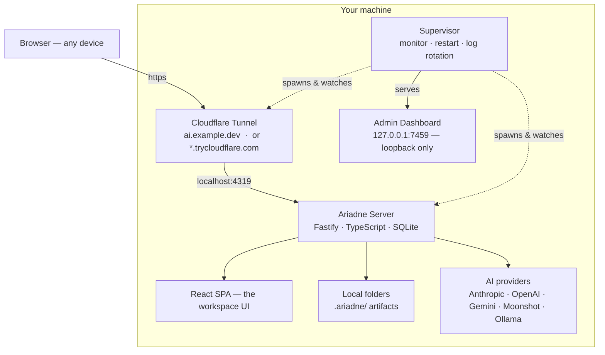

<div align="center">

# Ariadne

**An AI workspace that lives on your machine — and keeps a thread back to its sources.**


[Quick start](#quick-start) · [Highlights](#highlights) · [Screenshots](#screenshots) · [How it works](#how-it-runs) · [Deployment](#deployment)

</div>

---

Ariadne turns your local folders into source-backed work briefs. Every answer it
produces carries the files it read, a claim-to-source map, a list of unsupported
claims, a folder snapshot, a run trace, and a diff from the previous run —
stored in a portable, human-readable `.ariadne/` folder alongside your data.

It is not just a chat assistant. You can chat — with streaming replies,
attachments, web search, and an auto-triggered plan-and-execute agent — but the
deeper unit of work is a **run**: a reproducible, inspectable, evidence-backed
output you can trust and re-run over time.

---

## Highlights

- 💬 **Chat that remembers your folders.** Markdown rendered in place, file &
  image attachments, optional web search, and an *agent mode* that plans, runs
  tools, and revises itself as results come in. `auto` modes let the server
  classifier decide per message — no manual toggling for every question.
- 🧾 **Evidence-backed runs.** Pick a workspace, pick a template, approve which
  files Ariadne reads (the token-saving *Gasp Filter* proposes a short list),
  get a brief with every claim mapped to a source — and a diff from the last
  run so you see what changed when the folder changed.
- ⚡ **Custom actions.** Compose named per-workspace pipelines —
  `read_file` → `ask_ai` → `web_search` → `run_script` — and launch them in
  one click. Ariadne also suggests a matching action mid-chat when your
  message looks like the job (the live intent chip).
- 📊 **Custom dashboards.** Write a TypeScript surface for any workspace
  (`.ariadne/surface.tsx`) that runs in a sandboxed iframe with a postMessage
  SDK over your files. The repo ships a Portfolio example with live FX and
  stock quotes.
- ✏️ **Editable history.** Edit any user message in place — the prior version
  is saved as a revision (shown in the "수정됨 / Edited" popover), the old
  assistant reply is dropped, and a fresh answer streams in.
- 🔒 **Yours, locally.** Server runs on your own machine; only loopback can
  edit surfaces and scripts, even when a tunnel makes the URL public. Bring
  your own keys — or run keyless on Ollama out of the box.

---

## Screenshots

Real screenshots replace these placeholders as they're captured. See
[`docs/screenshots/README.md`](docs/screenshots/README.md) for the exact
capture instructions (page, state, framing, caption).


| # | Screenshot | Path |
|---|---|---|
| 1 | Portfolio dashboard with live FX + quotes | `docs/screenshots/portfolio.png` |
| 2 | Workspace overview (chat-first layout) | `docs/screenshots/workspace-overview.png` |
| 3 | Actions editor composing a pipeline | `docs/screenshots/actions-editor.png` |
| 4 | Action run with per-block timeline | `docs/screenshots/action-run.png` |
| 5 | Chat intent-suggestion chip | `docs/screenshots/intent-chip.png` |
| 6 | Agent mode plan unfolding | `docs/screenshots/agent-mode.png` |
| 7 | Edit a message → fresh reply regenerates | `docs/screenshots/edit-regenerate.png` |
| 8 | Tutorial page with SVG diagrams | `docs/screenshots/tutorial.png` |

---

## Why "Ariadne"?

In Greek myth, Ariadne's thread was what let Theseus retrace his way back out
of the Labyrinth — so *Ariadne's thread* came to mean any method that keeps
a traceable record of the path through a maze.

That is what this tool is for: every answer keeps a thread back to its
sources — the files it read, a claim-to-source map, a run trace, and a diff
from the last run.

---

## How it runs

The server runs on your machine and reads your local folders. A Cloudflare
Tunnel exposes it on a domain so other devices can reach it — either an
ephemeral `*.trycloudflare.com` URL (zero setup) or a stable custom domain
you own (see [Deployment](#deployment)). A separate supervisor keeps the
server and tunnel alive and observable.



Access is split by where the request comes from:

| | Local (`localhost`) | Remote (tunnel / custom domain) |
|---|---|---|
| Login | Not required | ID / password |
| Chat, browse, run templates | Yes | Yes |
| Create / edit shell scripts & surfaces | Yes | No — run / view only |

Remote requests are identified by the headers a Cloudflare tunnel always adds,
so a spoofed `Host` header cannot pass a tunnel request off as local.

---

## The two ways to work


**Chat** is the approachable entry point — streaming answers, attachments,
optional web search, and an **agent mode** that decomposes a task into steps,
runs tools, and revises its plan as results come in. Both web search and agent
mode have an `auto` setting: the server runs a tiny classifier per message
and decides whether to enable them.


**Runs** are the disciplined core. Register a folder as a workspace, pick a
template, and Ariadne scans the folder, proposes which files to read (the
token-saving *Gasp Filter*), waits for your approval, then generates a brief,
extracts claims, maps each to a source, and separates unsupported claims —
all written to `.ariadne/` and diffable against past runs.

---

## Quick start

```bash
ops/install-aliases.sh        # one-time: registers `ariadne` in ~/.zshrc
source ~/.zshrc

ariadne start                 # installs deps, builds the SPA, starts everything
```

`ariadne start` prints the local URL, the admin dashboard URL, and the public
tunnel URL.

| Command | Action |
|---|---|
| `ariadne start` / `stop` / `restart` | control the daemon |
| `ariadne status` | health and the current tunnel URL |
| `ariadne logs [server\|tunnel\|supervisor]` | tail a log |
| `ariadne admin` | open the admin dashboard |

Ports: server `4319`, admin dashboard `7459` (override with `ARIADNE_PORT` /
`ARIADNE_ADMIN_PORT`).

Accounts live in SQLite. Create one with:

```bash
tsx apps/server/scripts/create-account.ts <username> <password> [displayName] [role] [locale] [mode]
```

---

## Deployment

Ariadne is local-first — the server cannot be hosted on stateless edge platforms;
it needs your filesystem, local models, and processes. To serve it on a **stable
custom domain** instead of an ephemeral URL, bind it to a **named Cloudflare
Tunnel**. If you manage your domain on Cloudflare, one-time setup:

```bash
ops/setup-tunnel.sh ai.example.dev      # logs in, creates the tunnel, routes DNS
ariadne restart                         # the daemon now serves the custom domain
```

`setup-tunnel.sh` runs `cloudflared tunnel login` (opens a browser once),
`tunnel create`, and `tunnel route dns`, then writes `ARIADNE_TUNNEL_NAME` /
`ARIADNE_TUNNEL_HOSTNAME` into `.env`. From then on the supervisor runs the named
tunnel and your domain proxies straight to the local server. The site is up
whenever your machine and the daemon are running.

---

## AI providers

Ariadne is local-first: out of the box it runs on whatever models are installed
in your local **Ollama** — no key, no setup, nothing to type. The active model
is resolved to whatever Ollama actually has. Switch provider or model from the
chat composer, in Settings, or via `.env`:

| Provider | Configuration |
|---|---|
| `ollama` | default — local models, no key; the installed model is auto-detected |
| `anthropic` | `ANTHROPIC_API_KEY` |
| `openai` | `OPENAI_API_KEY` |
| `gemini` | `GEMINI_API_KEY` |
| `moonshot` | `MOONSHOT_API_KEY` (Kimi) |
| `mock` | no key — schema-correct stub output for testing |

Token usage is captured from every provider response, priced per model, and
reported per run and cumulatively.

A short triage classifier (also a provider call) decides, per message, whether
a web search would help and whether the question warrants the slower
plan-and-execute agent loop — so users can leave both toggles on `auto`.

**Embeddings (auto-pull).** Workspace files are auto-indexed into a
cosine-similarity vector store at scan time. If your local Ollama doesn't
have an embedding model yet, Ariadne kicks off a background
`ollama pull nomic-embed-text` on the first scan — the next scan picks it
up automatically (no UI dialog, ~300 MB download, ~one-minute affair). If
`OPENAI_API_KEY` is set, OpenAI `text-embedding-3-small` is used instead.
Until an embedding model is available, retrieval falls back to a keyword
ranker — same interface, no config change.

---

## Capabilities

- **Streaming chat** — token-by-token replies, markdown rendered in place,
  file / image attachments, edit-and-regenerate with kept revision history.
- **Skills** — account-scoped reusable prompt snippets. Surface them in any
  composer via the Sparkles button, or type `/name` for slash-command
  autocomplete. Create / edit / delete inline from Settings.
- **Agent mode (off / auto / on)** — a plan-and-execute loop with conditional
  re-planning (failures or low-information results only), surfaced as a live
  checklist of steps. `auto` mode classifies per message.
- **Custom actions** — declarative per-workspace block pipelines
  (`.ariadne/actions.yaml`) the agent planner can use. Six block types:
  `read_file`, `ask_ai`, `web_analysis`, `run_script`, `write_file` (output
  to disk with `{date}` / `{time}` substitution), `edit_file` (search/replace
  or full-content; **stages** under `.ariadne/staged/` for review rather than
  writing immediately), and `run_tests` (captures pass/fail for re-plan).
- **Staged diff review** — `edit_file` proposals land at `/runs/<id>/diff`
  with per-file checkboxes and a side-by-side line diff. Apply commits the
  selected files; Discard wipes the staged tree.
- **Agent attempts** — when the agent uses `edit_file`, edits accumulate
  into the chat's open *attempt* (one per chat). Review at
  `/attempts/<id>/diff`, then Apply or Abandon. A compact chip in the
  composer surfaces the attempt's file count.
- **Action schedules** — register an action to run hourly / daily / weekly /
  monthly. In-process scheduler ticks every 60s; combine with `write_file`
  to land scheduled outputs in `briefs/{date}.md` (or anywhere else).
- **Workspace history + rewind** — `.ariadne/` is its own git repo; every
  completed run lands a commit. The Run history widget shows recent commits
  with stats; on each `apply:` commit, a hover-revealed Rewind button
  restores the workspace to the state immediately before.
- **Embedding-aware retrieval** — when an Ollama embedding model
  (`nomic-embed-text` or `mxbai-embed-large`) is installed (or
  `OPENAI_API_KEY` is set), workspace files are auto-indexed into a
  cosine-similarity vector store at scan time. Falls back to a keyword
  ranker silently when no embedding model is available.
- **Symbol-boosted retrieval** — a regex-based code symbol indexer
  (function / class / method / const) over TS / JS / TSX / JSX / Python /
  Go / Rust / Java adds a small score nudge to chunks whose paths contain
  query-matched symbols. Cheap to maintain; better grounding for code-heavy
  workspaces.
- **Custom surfaces** — a workspace can carry a TypeScript dashboard
  (`.ariadne/surface.tsx`), built with esbuild and run in a sandboxed iframe
  with a postMessage SDK. Six starter templates ship: Portfolio (CSV +
  charts with live FX & stock quotes), Budget Tracker, Reading Library,
  Chefbook (ingredients + recipes), Code Project (TypeScript sandbox with
  the `edit_file` demo), plus Blank.
- **Gasp Filter** — proposes ≤8 source files per workspace size before any
  read, keeping token bills bounded and giving the user a context preview.
- **Evidence map + unsupported claims** — every claim in a brief is mapped to
  a source (`supported` / `partially_supported` / `inferred` / `unsupported`)
  and unsupported ones are reported with conservative rewrites.
- **Re-run diff** — repeat a run later and see new files, dropped context,
  changed conclusions, and evidence-strength deltas.
- **Documents** — PDF (OCR fallback for scans), DOCX, XLSX, Markdown, CSV,
  JSON, YAML; images go to vision-capable models.
- **Shell scripts** — `.sh` / `.py` scripts run against a workspace, behind
  a confirmation step and access gating.
- **Web search** — Tavily or Brave when keyed, keyless DuckDuckGo otherwise.
- **Accounts** — per-account language, a simplified *Simple mode* for
  non-technical users, and private / public workspace visibility.

---

## How Ariadne is different

| | ChatGPT / Claude.ai | Open WebUI / LibreChat | Cursor / Claude Code | **Ariadne** |
|---|---|---|---|---|
| Reads local folders | upload only | model-switch UI | yes (editor-first) | yes — native workspace |
| Evidence-mapped output | no | no | no | yes — claim-to-source + unsupported list |
| Re-runnable, diffable runs | no | no | no | yes — `.ariadne/` is portable |
| Custom workspace dashboards | no | no | no | yes — sandboxed surfaces (6 starters) |
| Composed action pipelines | no | no | no | yes — 7 block types + intent chip |
| Staged file edits with diff review | n/a | no | yes (apply per file) | yes — `/runs/<id>/diff` per-file checkboxes |
| Agent staging branches per chat | no | no | no | yes — `attempts` model + chip in composer |
| Edit-and-regenerate user messages | partial | partial | partial | yes — full revision history per message |
| Recurring scheduled runs | no | no | no | yes — hourly / daily / weekly / monthly |
| Workspace git history + rewind | no | no | partial (git outside) | yes — auto-commit + per-apply rewind button |
| Embedding RAG over workspace | no | varies | varies | yes — Ollama / OpenAI, auto-indexed |
| Code symbol retrieval boost | no | no | yes (LSP) | yes — regex symbol index over 8 languages |
| Self-host | no | yes | partial (cloud features) | yes — local-first + Cloudflare tunnel |
| Bring-your-own models | no | yes | partial | yes — incl. Ollama default, six providers |
| Per-account skills (`/translate` etc.) | no | no | no | yes — slash commands + composer button |

Ariadne sits in the gap between chat-only tools, editor-first coding agents,
and enterprise workflow automation — for researchers, analysts, consultants,
and engineers who already use AI and want their outputs grounded, verifiable,
re-runnable, and auditable in their own filesystem.

---

## Supported languages

| Language | UI | Notes |
|---|---|---|
| English | ✅ | default |
| 한국어 (Korean) | ✅ | first-class — every key in `apps/web/src/lib/i18n/ko.ts` |

The TypeScript `TranslationKey` union forces both files to share the same key
set at compile time — a missing translation is a build error, not a runtime
fallback.

---

## Project layout

```
packages/shared/   shared types, zod schemas, config, theme tokens, pricing
apps/server/       Fastify API, Gasp Filter, evidence engine, chat, agent, auth
apps/web/          React + Vite + Tailwind v4 — the workspace UI
apps/admin/        supervisor and the local admin dashboard
ops/               ariadne control script, tunnel setup, zshrc installer
docs/              PRODUCT_PLAN, ARCHITECTURE, DESIGN_GUIDELINE, diagrams, screenshots
```

## Development

```bash
npm install
npm run dev:server     # Fastify (tsx watch)
npm run dev:web        # Vite dev server, proxies /api to :4319
npm run typecheck      # strict TypeScript across all packages
npm run build:web      # production SPA bundle into apps/web/dist
```

## Status

v0.1 — the run loop, evidence map, streaming chat, edit-and-regenerate,
agent mode with auto-triage, intent suggestion chip, custom surfaces and
actions, accounts, document handling, web search, and the operations layer
are in place. See [`docs/PRODUCT_PLAN.md`](docs/PRODUCT_PLAN.md) for the
roadmap and [`docs/ARCHITECTURE.md`](docs/ARCHITECTURE.md) for the build
contract.
