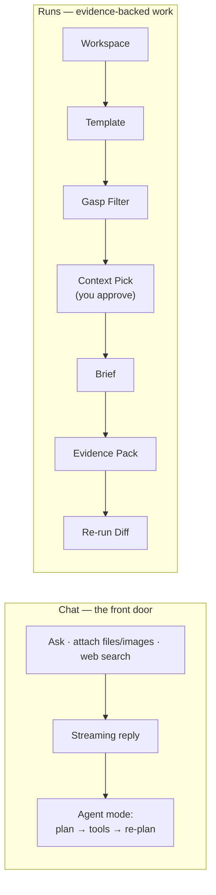

# Ariadne

Local-first AI workspace for traceable, repeatable work.

Ariadne runs on your own machine and turns local folders into source-backed work
briefs. Every brief it produces carries the files it read, a claim-to-source map,
a list of unsupported claims, a folder snapshot, a run trace, and a diff from the
previous run — stored in a portable, human-readable `.ariadne/` folder.

It is not just a chat assistant. You can chat — with streaming replies, file and
image attachments, web search, and an optional plan-and-execute agent — but the
deeper unit of work is a **run**: a reproducible, inspectable, evidence-backed
output you can trust and re-run over time.

---

## Why "Ariadne"?

In Greek myth, Ariadne's thread is what let Theseus retrace his way back out of
the Labyrinth — so "Ariadne's thread" came to mean any method that keeps a
traceable record of the path through a maze.

That is what this tool is for: every answer keeps a thread back to its sources
— the files it read, a claim-to-source map, a run trace, and a diff from the
last run.

---

## How it runs

The server runs on your machine and reads your local folders. A Cloudflare Tunnel
exposes it on a domain so other devices can reach it — either an ephemeral
`*.trycloudflare.com` URL (zero setup) or a stable custom domain you own (see
[Deployment](#deployment)). A separate supervisor keeps the server and tunnel
alive and observable.


Access is split by where the request comes from:

| | Local (`localhost`) | Remote (tunnel / custom domain) |
|---|---|---|
| Login | Not required | ID / password |
| Chat, browse, run templates | Yes | Yes |
| Create / edit shell scripts & surfaces | Yes | No — run / view only |

Remote requests are identified by the headers a Cloudflare tunnel always adds, so
a spoofed `Host` header cannot pass a tunnel request off as local.

---

## The two ways to work



**Chat** is the approachable entry point — streaming answers, attachments,
optional web search, and an **agent mode** that decomposes a task into steps,
runs tools (search, file reading, image analysis, templates, custom actions), and
revises its plan as results come in.

**Runs** are the disciplined core. Register a folder as a workspace, pick a
template, and Ariadne scans the folder, proposes which files to read (the
token-saving *Gasp Filter*), waits for your approval, then generates a brief,
extracts claims, maps each to a source, and separates unsupported claims — all
written to `.ariadne/` and diffable against past runs.

---

## Quick start

```bash
ops/install-aliases.sh        # one-time: registers `ariadne` in ~/.zshrc
source ~/.zshrc

ariadne start                 # installs deps, builds the SPA, starts everything
```

`ariadne start` prints the local URL, the admin dashboard URL, and the public
tunnel URL.

| Command | Action |
|---|---|
| `ariadne start` / `stop` / `restart` | control the daemon |
| `ariadne status` | health and the current tunnel URL |
| `ariadne logs [server\|tunnel\|supervisor]` | tail a log |
| `ariadne admin` | open the admin dashboard |

Ports: server `4319`, admin dashboard `7459` (override with `ARIADNE_PORT` /
`ARIADNE_ADMIN_PORT`).

Accounts live in SQLite. Create one with:

```bash
tsx apps/server/scripts/create-account.ts <username> <password> [displayName] [role] [locale] [mode]
```

---

## Deployment

Ariadne is local-first — the server cannot be hosted on stateless edge platforms;
it needs your filesystem, local models, and processes. To serve it on a **stable
custom domain** instead of an ephemeral URL, bind it to a **named Cloudflare
Tunnel**. If you manage your domain on Cloudflare, one-time setup:

```bash
ops/setup-tunnel.sh ai.kwanho.dev      # logs in, creates the tunnel, routes DNS
ariadne restart                        # the daemon now serves the custom domain
```

`setup-tunnel.sh` runs `cloudflared tunnel login` (opens a browser once),
`tunnel create`, and `tunnel route dns`, then writes `ARIADNE_TUNNEL_NAME` /
`ARIADNE_TUNNEL_HOSTNAME` into `.env`. From then on the supervisor runs the named
tunnel and your domain proxies straight to the local server. The site is up
whenever your machine and the daemon are running.

---

## AI providers

Ariadne is local-first: out of the box it runs on the models already installed
in your local **Ollama** — no key, no setup, nothing to type. The active model
is resolved to whatever Ollama actually has. Switch provider or model from the
chat composer, in Settings, or via `.env`:

| Provider | Configuration |
|---|---|
| `ollama` | default — local models, no key; the installed model is auto-detected |
| `anthropic` | `ANTHROPIC_API_KEY` |
| `openai` | `OPENAI_API_KEY` |
| `gemini` | `GEMINI_API_KEY` |
| `moonshot` | `MOONSHOT_API_KEY` (Kimi) |
| `mock` | no key — schema-correct stub output for testing |

Token usage is captured from every provider response, priced per model, and
reported per run and cumulatively.

---

## Screenshots

The views worth showing off. Drop PNGs at the listed paths and they render
inline. See [`docs/screenshots/README.md`](docs/screenshots/README.md) for
what each shot should show.

| Screenshot | Path |
|---|---|
| Portfolio dashboard — custom surface with live FX and quotes | `docs/screenshots/portfolio.png` |
| Workspace Data tab — editable CSV-as-a-table | `docs/screenshots/data-tab.png` |
| Actions editor — composing a block pipeline | `docs/screenshots/actions-editor.png` |
| Action run view — per-block timeline + final output | `docs/screenshots/action-run.png` |
| Chat intent-suggestion chip | `docs/screenshots/intent-chip.png` |
| Agent mode — plan and execute | `docs/screenshots/agent-mode.png` |


---

## Capabilities

- **Streaming chat** — token-by-token replies, markdown rendered in place, live
  progress, file / image attachments.
- **Agent mode** — a plan-and-execute loop with re-planning, surfaced as a live
  checklist of steps.
- **Custom surfaces** — a workspace can have a user-authored TypeScript screen
  (`.ariadne/surface.tsx`), built with esbuild and run in a sandboxed iframe with
  a postMessage SDK. Ships a Portfolio (CSV + charts) example.
- **Custom actions** — declarative per-workspace actions (`.ariadne/actions.yaml`)
  the agent planner can use: run a script, read a file, search, format.
- **Documents** — PDF (with OCR fallback for scans), DOCX, XLSX, Markdown, CSV,
  JSON, YAML; images go to vision-capable models.
- **Shell scripts** — `.sh` / `.py` scripts run against a workspace, behind a
  confirmation step and access gating.
- **Web search** — Tavily or Brave when keyed, keyless DuckDuckGo otherwise.
- **Accounts** — per-account language (English / 한국어), a simplified *Simple
  mode* for non-technical users, and private / public workspace visibility.

---

## Project layout

```
packages/shared/   shared types, zod schemas, config, theme tokens, pricing
apps/server/       Fastify API, Gasp Filter, evidence engine, chat, agent, auth
apps/web/          React + Vite + Tailwind — the workspace UI
apps/admin/        supervisor and the local admin dashboard
ops/               ariadne control script, tunnel setup, zshrc installer
docs/              PRODUCT_PLAN, DESIGN_GUIDELINE, ARCHITECTURE
```

## Development

```bash
npm install
npm run dev:server     # Fastify
npm run dev:web        # Vite dev server, proxies /api to :4319
npm run typecheck      # strict TypeScript across all packages
```

## Status

v0.1 — the run loop, evidence map, streaming chat, agent mode, custom surfaces and
actions, accounts, document handling, web search, and the operations layer are in
place. See [`docs/PRODUCT_PLAN.md`](docs/PRODUCT_PLAN.md) for the roadmap and
[`docs/ARCHITECTURE.md`](docs/ARCHITECTURE.md) for the build contract.
