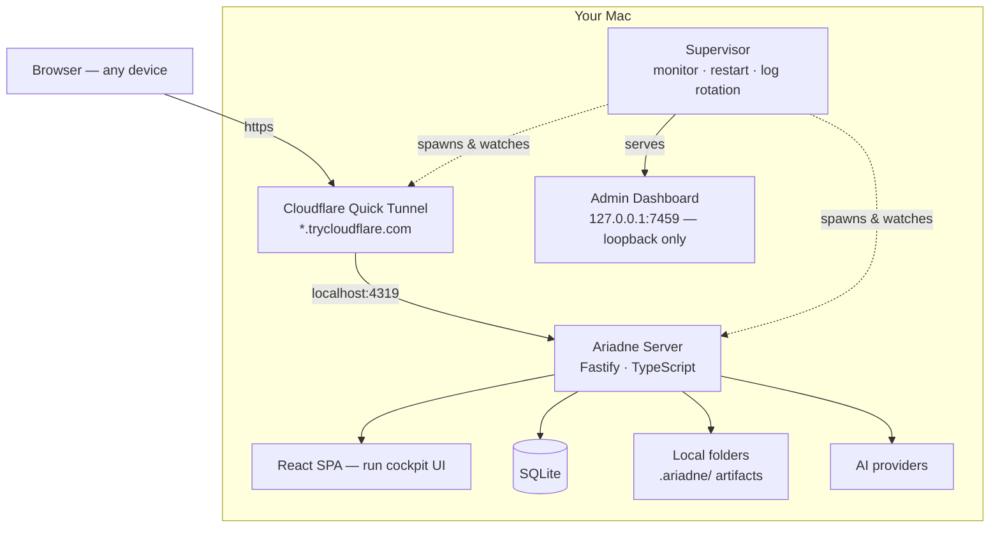
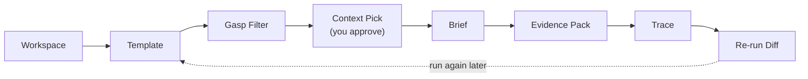

# Ariadne

Local-first AI workspace for traceable, repeatable work.

Ariadne turns local folders into source-backed work briefs. Every brief it
produces carries the files it read, a claim-to-source map, a list of unsupported
claims, a folder snapshot, a run trace, and a diff from the previous run — stored
in a portable, human-readable `.ariadne/` folder.

It is not a chat assistant. The unit of work is a **run**, not a message, and the
goal is output you can inspect, reproduce, and refine.

---

## How it runs

The server runs on your machine and reads your local folders. A Cloudflare Quick
Tunnel exposes it on a temporary domain so other devices can reach it — no
Cloudflare account or DNS setup required. A separate supervisor process keeps the
server and tunnel alive and observable.



Access is split by where the request comes from:

| | Local (`localhost`) | Remote (Cloudflare tunnel) |
|---|---|---|
| Login | Not required | ID / password |
| Browse, run templates, view briefs | Yes | Yes |
| Create or edit shell scripts | Yes | No — run-only |

Remote requests are identified by the headers a Cloudflare tunnel always adds, so
a spoofed `Host` header cannot pass a tunnel request off as local.

---

## The core loop



1. Register a local folder as a **workspace**.
2. Pick a **template** (Research Brief, Lecture Brief, Investment Memo, …).
3. The **Gasp Filter** scans cheap file metadata and proposes which files to read.
4. You review and approve the **context** before anything is sent to a model.
5. Ariadne generates the **brief**, extracts claims, maps each to a source, and
   separates unsupported claims.
6. The run, its evidence, and a snapshot are written to `.ariadne/`.
7. Re-run the template later and Ariadne shows what changed.

---

## Quick start

```bash
ops/install-aliases.sh        # one-time: registers `ariadne` in ~/.zshrc
source ~/.zshrc

ariadne start                 # installs deps, builds the SPA, starts everything
```

`ariadne start` prints the local URL, the admin dashboard URL, and the temporary
Cloudflare tunnel URL.

| Command | Action |
|---|---|
| `ariadne start` / `stop` / `restart` | control the daemon |
| `ariadne status` | health and the current tunnel URL |
| `ariadne logs [server\|tunnel\|supervisor]` | tail a log |
| `ariadne admin` | open the admin dashboard |

Ports: server `4319`, admin dashboard `7459` (override with `ARIADNE_PORT` /
`ARIADNE_ADMIN_PORT`).

Accounts are stored in SQLite. Create one with:

```bash
tsx apps/server/scripts/create-account.ts <username> <password> [displayName] [role]
```

---

## AI providers

The default provider is `mock`, which returns schema-correct output so the full
loop runs with no API key. Switch providers in Settings or via `.env`:

| Provider | Configuration |
|---|---|
| `anthropic` | `ANTHROPIC_API_KEY` |
| `openai` | `OPENAI_API_KEY` |
| `gemini` | `GEMINI_API_KEY` |
| `moonshot` | `MOONSHOT_API_KEY` (Kimi) |
| `ollama` | local models, no key — default `qwen2.5:14b` |
| `mock` | default; no key |

Token usage is captured from every provider response, priced per model, and
reported per run and cumulatively.

---

## Capabilities

- **Document parsing** — PDF, DOCX, XLSX, Markdown, CSV, JSON, YAML; images are
  routed to vision-capable models.
- **Shell scripts** — `.sh` scripts run against a workspace, editable locally and
  run-only over the tunnel, always behind a confirmation step.
- **Web search** — Tavily or Brave when an API key is set, otherwise a keyless
  DuckDuckGo fallback.

---

## Project layout

```
packages/shared/   shared types, zod schemas, config, pricing
apps/server/       Fastify API, Gasp Filter, evidence engine, auth, SPA host
apps/web/          React + Vite + Tailwind — the run cockpit UI
apps/admin/        supervisor and the local admin dashboard
ops/               ariadne control script and zshrc alias installer
docs/              PRODUCT_PLAN, DESIGN_GUIDELINE, ARCHITECTURE
```

## Development

```bash
npm install
npm run dev:server     # Fastify
npm run dev:web        # Vite dev server, proxies /api to :4319
npm run typecheck      # strict TypeScript across all packages
```

## Status

v0.1 — the core loop, evidence map, accounts, usage and cost tracking, document
and image handling, shell scripts, web search, and the operations layer are in
place. See [`docs/PRODUCT_PLAN.md`](docs/PRODUCT_PLAN.md) for the roadmap.
