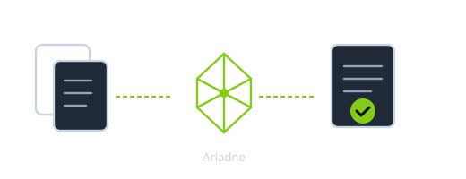
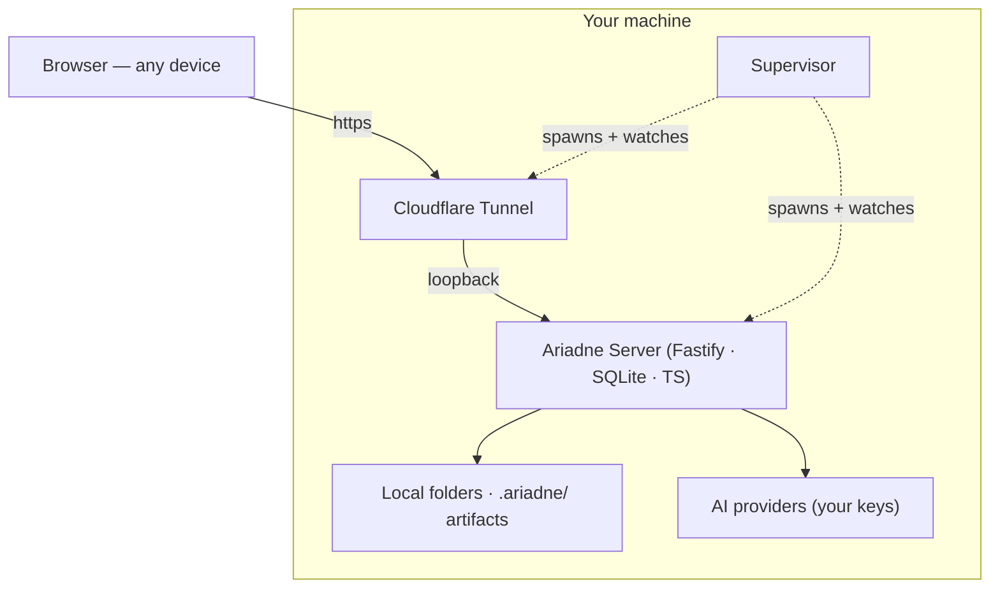

<div align="center">

# Ariadne

**The local-first AI workspace you can see into.**

Ask questions over your PDFs, slides, CSVs, notes, and code — and get
answers that **cite their source**, **read the actual images** on your
slides (not just the text), and are **fact-checked against those sources**
before you trust them. Automate repeatable work; review every AI edit as a
staged diff. Runs on your machine — your files and keys never leave, and it
never trains on your data.

One app that's both a power-user IDE and an approachable assistant
(toggle per workspace), and a platform you build on — ship your own
dashboard as a sandboxed React surface the host feeds with files, live
data, retrieval, and the model.



[](LICENSE)
[](docs/INSTALL.md)
[](docs/RAG_HARNESS.md)

[How to use](docs/HOW_TO_USE.md) · [Install (5 min)](docs/INSTALL.md) · [API](docs/API.md)

</div>

> **Ariadne does not train on your data.**
> It improves by turning your corrections into [eval cases](docs/RAG_HARNESS.md)
> the next version has to pass.

---

## 30-second demo

> Real screencasts replace these placeholders as they're captured.

| | Demo | What it shows |
|---|---|---|
| 📄 | **Docs folder → answer with evidence** | Drop a folder of PDFs / Markdown / notes. Ask a question. Every claim in the answer links back to the file + line that supports it. Unsupported claims are reported separately, not hidden. |
| 📊 | **CSV folder → dashboard + monthly report** | Point at a folder of holdings / budgets / experiments. Get a sandboxed TypeScript dashboard you can edit, plus a scheduled monthly brief that lands in the folder. |
| ✏️ | **Code folder → staged AI edit → test → apply** | "Fix this function." The agent stages a diff in `.ariadne/staged/`, runs your tests, re-plans on failure, and waits for an explicit Apply click before touching disk. |

---

## Why not just Claude Code / Cursor / ChatGPT?

| | ChatGPT / Claude.ai | Cursor / Claude Code | **Ariadne** |
|---|---|---|---|
| Editor-first | no | **yes** | no — workspace-first |
| Code-only | no | mostly | no — PDFs, CSVs, notes, code |
| Silently edits your files | n/a | usually configurable | **never — every edit is a staged diff** |
| Sends your files to a vendor's cloud | yes | usually | **only via your own API key, to a vendor you chose** |
| Keeps an evidence trail | no | no | **yes — claim → source map + unsupported list** |
| Re-runnable, diffable outputs | no | no | **yes — `.ariadne/` is a git-trackable artifact folder** |
| Trains on your data | model-dependent | model-dependent | **no — corrections become eval cases, not training data** |
| Self-host | no | partial | **yes — runs on your machine; optional Cloudflare tunnel** |

Ariadne is **not** a Claude Code / Cursor replacement — those win the
editor-first race. Ariadne is for the work that lives **outside** an
IDE: research, analysis, recurring reports, document review, and the
"AI touched my files, what changed?" question that every other tool
asks you to trust on faith.

---

## Install

```bash
git clone https://github.com/KKWANH/ai-assistant.git ariadne
cd ariadne
npm install
cp .env.example .env          # add provider keys, or leave blank for Ollama
ops/install-aliases.sh        # registers `ariadne` in your shell
source ~/.zshrc               # or ~/.bashrc
ariadne start                 # http://localhost:4319
```

The 5-minute path is in [`docs/INSTALL.md`](docs/INSTALL.md).
Defaults run keyless on local **Ollama**; the chat composer lets you
switch providers (Anthropic / OpenAI / Gemini / Moonshot-Kimi / vLLM
self-hosted / Mock) at any time. None of these are required to install.

---

## Try the demo workspaces

Each one is one click in the workspace dialog — pre-populated files,
the right surface dashboard, and (where relevant) an action template
you can run on the sample data without ever touching the rest of your
machine.

| Starter | What it is |
|---|---|
| **Tutorial workspace** | The safe playground. Real sample files, doesn't touch your data. Open it first. |
| **Investment portfolio** | Multi-currency holdings CSV → live FX/quote dashboard + monthly digest. |
| **Reading library** | Books + papers tracker with status, ratings, reading-pace chart. |
| **Research papers** | Notes + .bib → inbound-citation count + dangling-citation audit. |
| **Decisions log** | PRD + ADR + open-questions, weekly digest schedule, agent-stage-an-ADR action. |
| **Code project** | Tiny TypeScript sandbox + an `edit_file` demo for the staged-diff workflow. |
| **Budget tracker**, **Chefbook**, **Blank** | More surfaces to crib from. |

---

## What's under the hood

- **Multi-provider**: Anthropic, OpenAI, Gemini, Moonshot/Kimi (incl.
  Kimi Code), Ollama (local), vLLM (self-hosted), Mock. Bring your
  own keys.
- **Hybrid retrieval**: BM25/FTS5 + cosine embeddings + symbol index,
  fused via reciprocal-rank fusion. Auto-pulled `nomic-embed-text`
  on first scan if Ollama is the active provider.
- **Sees your documents**: attached PDFs / PPTX / DOCX are rendered to
  page images for a vision model — so it reads slides, figures, and
  scanned pages, not just extracted text (a model literally describes
  the artwork on a slide, not a guess from the filename).
- **Grounded, not confident-wrong**: factual answers that rest on
  sources are cross-checked against those sources after drafting — a
  wrong date / name / attribution gets corrected (or flagged
  uncertain), and visual claims are re-checked against the actual
  image. Accuracy over fluency.
- **Plan-and-execute agent**: planner uses JSON-schema guided decoding
  so silent parse-failure → empty-plan can't happen. Re-plans on
  tool failure or low-information results.
- **Staged-diff invariant**: every AI-proposed file edit lands in
  `.ariadne/staged/`, applied only on explicit user click.
- **MCP client**: stdio MCP servers wire in via `Settings → MCP`;
  the agent planner gets the live tool list.
- **Eval harness**: `npm run eval:retrieval` (no keys), `eval:strategy`,
  `eval:rag`, `--concurrency=N` on the live-generation runner for
  batched backends. Bad answers can be promoted into eval cases the
  next release has to pass — see [`docs/RAG_HARNESS.md`](docs/RAG_HARNESS.md).
- **Hooks**: `.ariadne/hooks.yaml` runs commands on staged-edit apply,
  scan complete, memory add, etc. Loopback-edit only.
- **Custom surfaces**: write a TS dashboard in `.ariadne/surface.tsx`
  (single file) **or** `.ariadne/surface/index.tsx` (folder form with
  imports — preferred when the dashboard grows past one file). Runs in
  a sandboxed iframe with a postMessage SDK over your files. See
  [`docs/ARCHITECTURE.md`](docs/ARCHITECTURE.md) §"Custom surfaces"
  and [`docs/PORTFOLIO_STARTER_V2.md`](docs/PORTFOLIO_STARTER_V2.md)
  for a real multi-file dashboard.

Architecture is in [`docs/ARCHITECTURE.md`](docs/ARCHITECTURE.md);
the speed contract that keeps the app fast as it grows is in
[`docs/PERFORMANCE_ARCHITECTURE.md`](docs/PERFORMANCE_ARCHITECTURE.md).

---

## Eval harness — the "measurably better" promise

Every change to retrieval/generation has to clear the same harness
that ships with the repo. Current numbers on the in-repo fixtures
(34 retrieval cases, keyword-only — `npm run eval:retrieval`):

| Metric | Value |
|---|---|
| Hit@1 | 55.9% |
| Hit@6 | 76.5% |
| MRR | 0.657 |
| nDCG@6 | 0.685 |
| Distractor leak rate | 5.9% |
| Indexed coverage | 85.7% |
| p95 latency | 0.2 ms |

Hybrid (BM25 + embeddings + symbol) lifts these meaningfully — see
[`docs/RAG_HARNESS.md`](docs/RAG_HARNESS.md) for the comparison and
the methodology.

---

## How it runs

The server runs on **your machine** and reads **your local folders**.
A Cloudflare Tunnel optionally exposes it on a domain so other
devices can reach it. The supervisor keeps the server and tunnel
alive.

Loopback (`localhost`) and remote (tunnel) requests are split: anyone
on the tunnel can read + chat + run pre-approved actions, but only
loopback can edit surfaces, scripts, hooks, or MCP servers. Spoofed
`Host` headers can't cross this line — the gate uses the
`cf-connecting-ip` header the tunnel always adds.



See [`SECURITY.md`](SECURITY.md) for the explicit threat model.

---

## Status & roadmap

v0.1-era. The run loop, evidence map, streaming chat, agent mode,
custom surfaces and actions, multi-provider routing (incl. Kimi Code
+ self-hosted vLLM), MCP, hooks, accounts, document handling, web
search, eval harness, and the ops layer are in place.

What's pending lives in:

- [`docs/PERFORMANCE_ARCHITECTURE.md`](docs/PERFORMANCE_ARCHITECTURE.md) —
  speed contract (cold-load / TTFT / retrieval / bundle budgets)
- [`docs/PORTFOLIO_STARTER_V2.md`](docs/PORTFOLIO_STARTER_V2.md) —
  brokerage-app workspace shape (multi-account + 3-tier analysis)

## Contributing

Read [`CONTRIBUTING.md`](CONTRIBUTING.md) — DCO sign-off, what's in
scope, how to add an eval case. Bug reports especially welcome at
this stage.

## Why "Ariadne"?

In Greek myth, Ariadne's thread was what let Theseus retrace his way
out of the Labyrinth — so *Ariadne's thread* came to mean any method
that keeps a traceable record of the path through a maze. That is
the whole product, in one image.

## License

[AGPL-3.0-or-later](LICENSE) — a self-hosted modified version offered over a
network must publish its source, which blocks proprietary hosted forks while
keeping Ariadne fully open.
