# Ariadne 완전 해설 — AI는 어떻게 "내 자료로" 똑똑하게 답하나

> **이 문서는 누구를 위한 글인가?**
> AI에 대해 "이름만 들어봤다" 수준이어도 끝까지 따라올 수 있게 썼습니다.
> 전문 용어는 처음 나올 때마다 **일상 비유 → 그림 → 실제 우리 코드** 순서로 풉니다.
>
> **짝꿍 자료:** 같은 내용을 큰 그림으로 빠르게 보려면 옆의
> `02-rag-harness-deck.pptx`(슬라이드, 애니메이션)부터 보세요. 그다음 이 문서로
> 천천히 깊게 읽으면 됩니다. PPT = 지도, MD = 안내서.
>
> **그림이 코드처럼 보이면?** 이 문서의 다이어그램은 `mermaid` 형식입니다.
> GitHub·VS Code·Obsidian에서는 자동으로 **그림으로** 보입니다. 안 보이면 그
> 블록을 [mermaid.live](https://mermaid.live)에 붙여넣으면 됩니다.

---

## 목차

0. [한 장 요약](#0-한-장-요약)
1. [출발점 — LLM이 도대체 뭔가](#1-출발점--llm이-도대체-뭔가)
2. [문제 — 똑똑한데 왜 자꾸 틀리나](#2-문제--똑똑한데-왜-자꾸-틀리나)
3. [RAG — 오픈북 시험으로 바꾸기](#3-rag--오픈북-시험으로-바꾸기)
4. [검색 내부 ① 청킹 — 책을 포스트잇 단위로](#4-검색-내부--청킹--책을-포스트잇-단위로)
5. [검색 내부 ② 임베딩 — 의미를 좌표로](#5-검색-내부--임베딩--의미를-좌표로)
6. [검색 내부 ③ 세 가지 검색과 합치기(하이브리드)](#6-검색-내부--세-가지-검색과-합치기하이브리드)
7. [하네스 — AI가 스스로 일하게 만들기](#7-하네스--ai가-스스로-일하게-만들기)
8. [컨텍스트 엔지니어링 — 작업기억을 아껴쓰기](#8-컨텍스트-엔지니어링--작업기억을-아껴쓰기)
9. [이 레포(Ariadne)의 구조](#9-이-레포ariadne의-구조)
10. [좋아졌다를 증명하는 법 — eval 하네스](#10-좋아졌다를-증명하는-법--eval-하네스)
11. [용어 사전](#11-용어-사전)

---

## 0. 한 장 요약

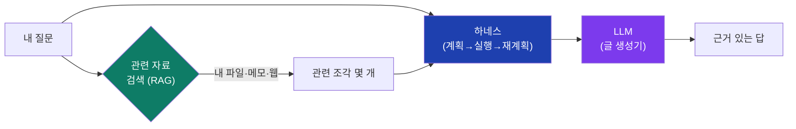

- **LLM** = "다음에 올 말"을 기막히게 잘 맞히는 거대한 글 생성기. 똑똑하지만
  *내 자료*나 *최신 정보*는 모르고, 모르면 그럴듯하게 **지어냅니다(환각).**
- **RAG**(검색 증강 생성) = 답하기 전에 *관련 자료를 찾아서* LLM에게 같이 쥐여
  주는 것. 오픈북 시험으로 바꾸는 셈.
- **하네스(harness)** = LLM 한 번 호출로 안 끝나는 일을, *계획하고 도구를 쓰고
  다시 계획하게* 묶어주는 "작업 골격".
- **Ariadne** = 이 모든 걸 **내 컴퓨터 안에서(local-first)** 돌리는 AI 작업공간.

이 문서는 위 그림의 각 상자를 하나씩, 바닥부터 풉니다.

---

## 1. 출발점 — LLM이 도대체 뭔가

**LLM**(Large Language Model, 거대 언어 모델)은 한 문장으로 이렇게 설명됩니다:

> 인터넷만큼 많은 글을 읽고, **"이 다음에 올 단어"를 확률로 맞히도록** 훈련된
> 프로그램.

비유하자면 — **세상 책을 거의 다 읽은 사람에게 빈칸 채우기를 시키는 것**입니다.

```
"아침에 일어나서 나는 ___" → (커피를, 세수를, 학교에…) 중 확률 높은 걸 고름
```

이 "빈칸 채우기"를 한 단어 고르고 → 그 단어를 문장에 붙이고 → 또 다음 빈칸을
채우고… 이걸 수백 번 반복하면 **문단**, **코드**, **답변**이 나옵니다.

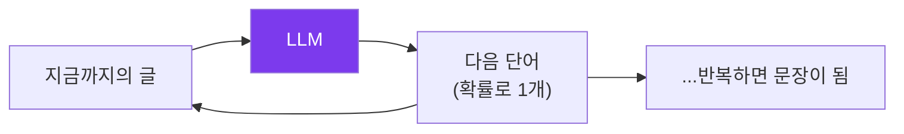

핵심 포인트 3가지:

1. **LLM은 '사실 저장고'가 아니라 '말투·패턴 학습기'다.** 훈련 중 본 사실을
   *기억하기도* 하지만, 그건 부정확하고 흐릿한 기억입니다.
2. **LLM은 훈련이 끝난 시점까지만 안다.** 어제 뉴스, 내 어제 메모는 모릅니다.
3. **LLM은 모를 때도 멈추지 않는다.** 빈칸은 *무조건* 채웁니다. 그래서 그럴듯한
   거짓말 — **환각(hallucination)** — 이 나옵니다.

> Ariadne에서 기본으로 쓰는 로컬 LLM은 `qwen3:8b`입니다. "8b"는 모델의 크기
> (80억 개 파라미터). 내 Mac 안에서 도는 작고 빠른 모델이라, 위 3가지 한계가
> 클라우드 거대 모델보다 더 두드러집니다 — 그래서 아래 RAG·하네스가 *더* 중요해
> 집니다.

---

## 2. 문제 — 똑똑한데 왜 자꾸 틀리나

LLM만 덜렁 쓰면 이런 일이 벌어집니다:

| 물어보면 | LLM 혼자서는 | 왜 |
|---|---|---|
| "내 포트폴리오에서 테슬라 비중?" | 아무 숫자나 지어냄 | 내 파일을 본 적 없음 |
| "어제 발표된 환율?" | 옛날 값 또는 추측 | 훈련 이후 정보 없음 |
| "이 코드의 `applyLoyaltyDiscount` 뭐 함?" | 비슷한 코드로 때려맞힘 | 내 레포를 모름 |

문제의 본질은 하나입니다: **LLM의 '머릿속'에 답에 필요한 자료가 없다.**

그럼 답은 자명합니다 — **답하기 전에, 필요한 자료를 찾아서 같이 주자.**
이게 RAG입니다.

---

## 3. RAG — 오픈북 시험으로 바꾸기

**RAG = Retrieval-Augmented Generation = 검색(Retrieval)으로 보강한(Augmented)
생성(Generation).**

가장 좋은 비유는 **시험 방식**입니다:

- **LLM 혼자** = *암기 시험.* 머릿속 기억에만 의존 → 모르면 찍음(환각).
- **RAG** = *오픈북 시험.* 문제와 관련된 페이지를 먼저 펼쳐주고 풀게 함 →
  근거를 보고 답함.

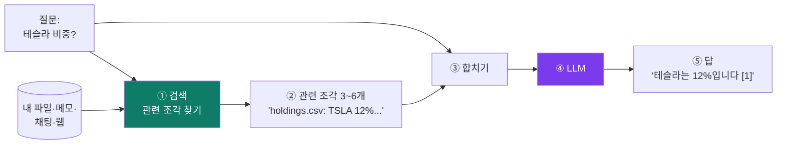

흐름은 딱 5단계:

1. **검색** — 질문과 관련 있는 자료 조각을 창고에서 꺼낸다.
2. **선별** — 그중 가장 관련 높은 몇 개(보통 6개)만 고른다.
3. **합치기** — `[자료 조각들] + [원래 질문]`을 한 덩어리 프롬프트로 만든다.
4. **생성** — 그 프롬프트를 LLM에 준다. 이제 LLM은 *보고* 답한다.
5. **답** — 근거가 있는 답. (Ariadne는 `[1]`처럼 출처 번호도 붙입니다.)

**RAG가 환각을 줄이는 이유:** LLM이 "기억"이 아니라 "지금 눈앞의 자료"를 보고
답하기 때문. 빈칸을 *상상*으로 채우는 대신 *복사·요약*하게 됩니다.

그런데 3단계까지 가려면, "관련 있는 조각"을 어떻게 **찾느냐**가 관건입니다.
이게 검색의 내부 — 다음 세 장의 주제입니다.

---

## 4. 검색 내부 ① 청킹 — 책을 포스트잇 단위로

검색하려면 먼저 자료를 **검색 가능한 단위**로 잘라야 합니다. 이 자르기를
**청킹(chunking)**, 잘린 조각을 **청크(chunk)**라고 합니다.

**왜 통째로 안 쓰고 자르나?** 두 가지 이유:

1. **정밀도.** 100쪽짜리 문서 전체를 주면 LLM은 핵심을 놓칩니다(중간 내용은
   특히 잘 잊음 — "lost in the middle" 현상). 관련 *문단*만 콕 집어 주는 게 낫습니다.
2. **용량.** LLM이 한 번에 읽을 수 있는 양(컨텍스트 창)은 정해져 있습니다.
   다 못 넣습니다.

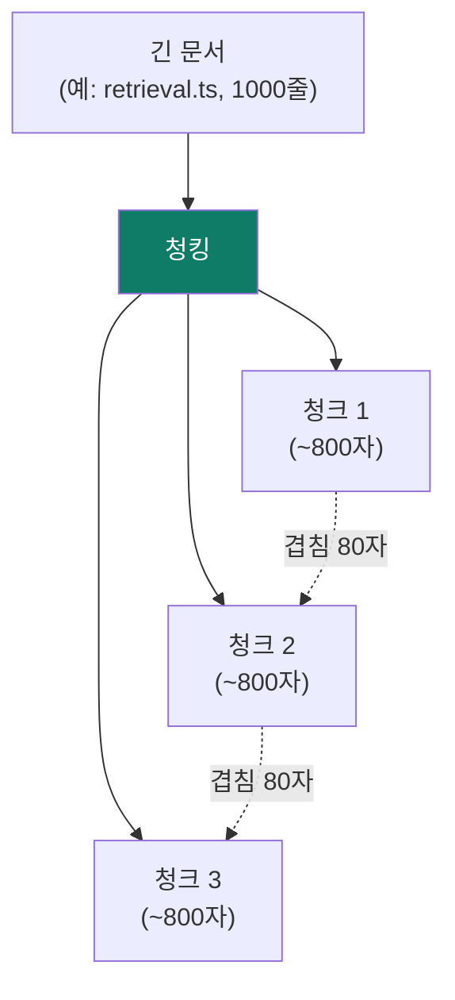

**Ariadne의 청킹 규칙** (`apps/server/src/services/retrieval.ts`):

- 한 청크는 최대 **800자**(`CHUNK_CHARS`). 한국어·영어 기준 대략 한두 문단.
- 청크 사이에 **80자 겹침**(`CHUNK_OVERLAP`). 문장이 경계에서 잘려 검색이
  안 되는 걸 막으려고, 앞 청크 꼬리를 다음 청크에 살짝 물립니다.
- 자르는 위치는 **빈 줄(문단 경계)** 우선. 문장 중간을 함부로 안 끊습니다.

> **우리가 개선한 것 (P2 — "구조적 contextual 청킹"):**
> 청크만 딸랑 떼어내면 *"이게 어느 파일의 어느 절 얘기인지"* 가 사라집니다.
> 예: `"return Math.round(subtotal * (1 - tier.percentOff / 100))"` — 이 조각만
> 보면 무슨 함수인지 모릅니다. 그래서 각 청크 맨 앞에
> **`파일경로 › 가장 가까운 제목`** 을 붙여서 저장합니다:
> ```
> src/pricing.ts › applyLoyaltyDiscount
>
> return Math.round(subtotal * (1 - tier.percentOff / 100))
> ```
> 이러면 "출처"가 검색 색인에 같이 들어가서, 파일/절 이름으로도 잘 찾힙니다.
> LLM을 한 번도 안 부르는 공짜 기법인데, 우리 측정에서 **Hit@1을 76.5% →
> 82.4%** 로 올렸습니다(뒤에서 이 숫자가 뭔지 설명합니다).

---

## 5. 검색 내부 ② 임베딩 — 의미를 좌표로

이제 청크들이 생겼습니다. 질문이 들어오면 *관련 있는* 청크를 어떻게 고를까요?
순진한 방법은 **단어가 겹치는 청크**를 찾는 것입니다. 하지만 이건 약합니다:

- 질문: "차 할인" / 문서: "자동차 세일" → **단어가 안 겹쳐서** 놓침.

사람은 "차 = 자동차", "할인 = 세일"이 *뜻이 같다*는 걸 압니다. 기계도 그렇게
하려면 **뜻을 숫자로** 바꿔야 합니다. 이게 **임베딩(embedding)**입니다.

> **임베딩 = 문장의 '의미'를 수백 개 숫자로 된 좌표(벡터)로 바꾸는 것.**
> 뜻이 비슷한 문장은 **좌표상 가까이** 놓이도록 훈련돼 있습니다.

비유: **의미의 지도.** 모든 문장을 거대한 지도 위 한 점으로 찍습니다. "강아지"와
"개"는 바로 옆 동네, "강아지"와 "세금"은 정반대 끝.

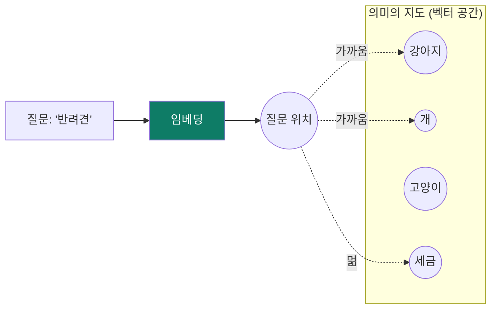

**검색 방법:** 질문도 같은 방식으로 좌표를 찍고(임베딩), 그 점에서 **가장 가까운**
청크들을 고릅니다. "가깝다"는 **코사인 유사도(cosine similarity)** 라는 자로 잽니다
(두 벡터가 이루는 각도가 작을수록 1에 가깝게 = 비슷함).

**Ariadne에서:**

- 임베딩 모델은 로컬 `nomic-embed-text`(Ollama). API 키도 비용도 없습니다.
- 청크마다 벡터를 계산해 **SQLite 데이터베이스**에 저장(색인, index)합니다.
- 파일이 바뀌면 그 파일 청크만 다시 계산(증분 색인). 안 바뀌면 건너뜀.
- 질문이 오면 질문 벡터와 모든 청크 벡터의 코사인 유사도를 재서 상위 몇 개 반환.

이렇게 "뜻으로 찾기"를 **의미 검색(semantic search)** 이라고 합니다.

---

## 6. 검색 내부 ③ 세 가지 검색과 합치기(하이브리드)

의미 검색은 강력하지만 만능이 아닙니다. 정반대 약점을 가진 방법들을 **섞어야**
가장 셉니다. Ariadne는 세 가지를 씁니다:

| 방법 | 잘하는 것 | 못하는 것 |
|---|---|---|
| **키워드(BM25)** | *정확한 단어*·희귀 용어·고유명사·코드 식별자 | 동의어·말바꿈 |
| **의미(임베딩)** | *뜻*·동의어·말바꿈·다른 언어(한↔영) | 정확한 철자·희귀 토큰 |
| **심볼(symbol)** | 코드의 함수/클래스 *이름* | 일반 문장 |

- **BM25**: 검색엔진의 고전. "이 단어가 이 문서에 몇 번, 얼마나 드물게
  나오나"로 점수. Ariadne는 SQLite의 전문검색(FTS5)으로 구현.
- **심볼 부스트**: 코드 파일을 **tree-sitter**라는 파서로 훑어 함수·클래스
  이름을 뽑아두고, 질문 단어가 그 이름과 맞으면 그 파일 청크에 가산점.

**핵심 아이디어 — 셋을 합치면(하이브리드) 서로의 약점을 메웁니다.** 합치는
방법이 **RRF(Reciprocal Rank Fusion, 상호 순위 융합)**:

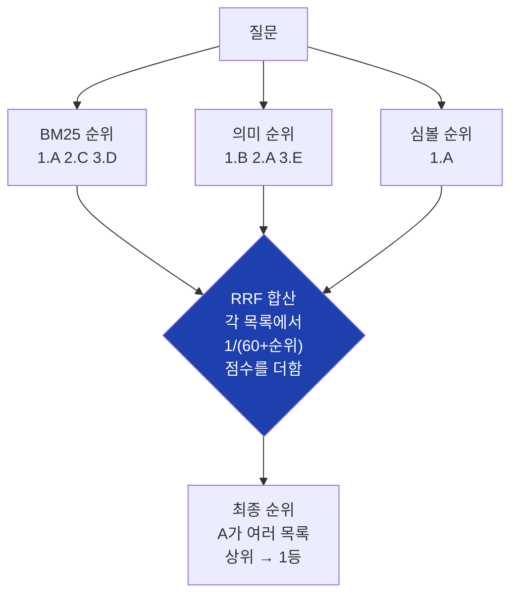

RRF가 영리한 이유: 세 방법의 *점수 단위가 제각각*(BM25는 0~무한대, 코사인은
0~1)이라 그냥 더하면 엉망이 됩니다. RRF는 **점수 대신 '순위'만** 씁니다 —
"각 목록에서 몇 등이었나"를 `1/(60+등수)`로 환산해 더합니다. 그래서 단위 맞추기
·가중치 조정이 **필요 없습니다**(상수 60은 표준값).

> **우리가 개선한 것 (P1 — 하이브리드를 실제로 연결):**
> 놀랍게도, 이 하이브리드 검색은 *코드에 이미 만들어져 있었는데 실제 채팅에서는
> 안 쓰이고* 있었습니다. 채팅은 의미 검색 하나만 쓰고 있었죠. 그래서 한 줄을
> 바꿔 채팅 경로가 하이브리드를 쓰게 했더니, 우리 측정에서:
>
> | | 첫 결과 정확도(Hit@1) | 평균 순위 품질(MRR) |
> |---|---|---|
> | 이전(의미만) | 52.9% | 0.697 |
> | **이후(하이브리드)** | **76.5%** | **0.877** |
>
> "이미 만든 좋은 것을 안 켜고 있었다"를 **숫자로** 잡아낸 사례입니다.

---

## 7. 하네스 — AI가 스스로 일하게 만들기

지금까지는 "한 번 검색 → 한 번 답"이었습니다. 하지만 어려운 일은 한 방에 안
됩니다. 예: *"이 CSV에서 이상치를 찾아 요약하고, 관련 최신 뉴스도 붙여줘."*

이런 일은 **여러 단계 + 도구 사용 + 중간 점검**이 필요합니다. 이걸 묶어주는
"작업 골격"이 **하네스(harness)** — 우리 코드에선 *에이전트(agent)* 라고 부릅니다.

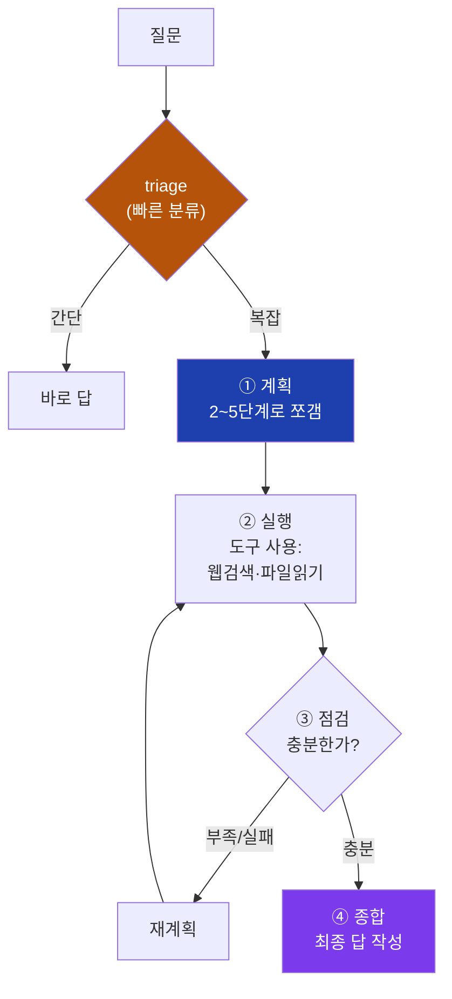

단계별로:

- **triage(분류)**: 매 메시지마다 먼저 *"이건 어떻게 처리할까?"* 를 싸게 판단.
  에이전트를 돌릴지, 웹검색이 필요한지, 제목은 뭘로 할지 등.
- **계획(plan)**: 작업을 2~5개 작은 단계로 분해.
- **실행(execute)**: 각 단계에서 **도구**를 씀 — 웹 검색, 파일 읽기, 목록 보기.
  서로 독립인 단계는 **동시에**(병렬) 실행해 시간을 아낍니다.
- **재계획(replan)**: 어떤 단계가 실패하거나 정보가 부실하면 남은 계획을 수정.
  무한루프 방지로 최대 횟수 제한(`MAX_STEPS=8`, `MAX_REPLANS=2`).
- **종합(synthesize)**: 단계 결과들을 모아 하나의 답으로.

**Deep 모드 — 분신술.** 정말 큰 질문은 **여러 서브에이전트로 쪼개 병렬**로
조사한 뒤 합칩니다(오케스트레이터). 각 서브에이전트는 자기 몫만 깊게 파고,
오케스트레이터엔 **요약만** 돌려줍니다(자세한 건 자기 안에 가둠). 비용이 크니
사용자가 명시적으로 켤 때만.

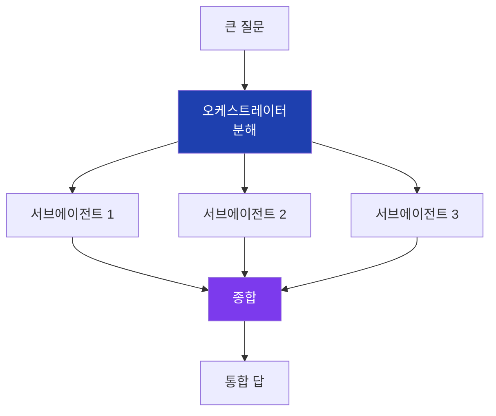

> **우리가 개선한 것 (Tier 1·2):**
> - 예전엔 메시지 한 개에 **분류용 LLM 호출이 4번** 따로 났습니다. 이걸 **1번**으로
>   합치고(triage 융합), 그 1번을 **빠른 클라우드 모델(Gemini Flash)** 로 보냈습니다.
>   *어려운 추론*은 로컬 모델, *쉬운 분류*는 빠른 모델 — 일을 난이도별로 나눈 것.
> - 서브에이전트가 *전체 답*을 다 토해내 종합 단계가 터지던 걸, **요약 상한**을
>   둬서 깔끔하게 만들었습니다.

---

## 8. 컨텍스트 엔지니어링 — 작업기억을 아껴쓰기

LLM의 **컨텍스트 창(context window)** = 한 번에 볼 수 있는 글의 양 = LLM의
**작업기억(RAM)**. 한정돼 있고, *꽉 채울수록 중간 내용을 잘 잊습니다*(lost in
the middle). 그래서 "무엇을, 얼마나, 어떤 순서로 넣느냐"가 품질을 좌우합니다 —
이걸 **컨텍스트 엔지니어링**이라 합니다. 세 가지 핵심 기법:

1. **압축(compaction).** 대화가 길어지면 옛 대화를 **구조화 요약**으로 접습니다.
   그냥 줄이는 게 아니라 `## 결정 / ## 미해결 / ## 사실` 섹션으로 나눠서
   *결정사항과 미해결 과제가 날아가지 않게* 합니다.

2. **캐싱(caching) — 속도.** 프롬프트의 *앞부분*을 매번 똑같이 유지하면, 모델
   서버가 그 부분 계산을 **재활용**합니다(KV 캐시). 그래서 변하는 내용(검색 결과
   ·대화)은 *뒤쪽*에 둡니다. 앞을 흔들면 캐시가 깨져서 느려집니다.

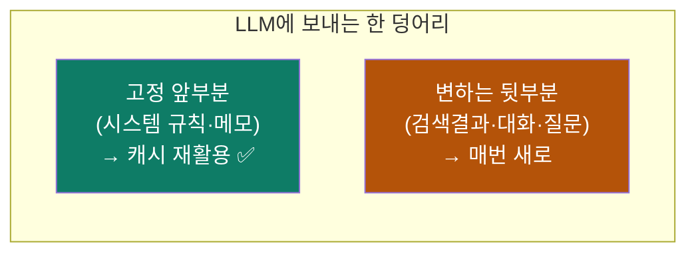

3. **모델 라우팅(routing) — 속도↔지능.** 모든 일을 한 모델로 하지 않습니다.
   *쉬운 분류*는 작고 빠른(또는 클라우드 빠른) 모델, *어려운 추론*은 크고 똑똑한
   모델. "택배 분류는 알바, 수술은 전문의"처럼 일을 난이도로 나눕니다.

> **로컬 모델 추가 튜닝(Tier 3):** Ariadne의 로컬 ollama가 컨텍스트 창을 겨우
> **4096**으로 잡고 있어서, 우리가 애써 모아준 자료의 뒷부분이 **조용히 잘리고**
> 있었습니다. 이를 **16384**로 키우고(설정 한 줄), 모델을 메모리에 상주시켜
> 매번 다시 로딩되는 지연을 없앴습니다.

---

## 9. 이 레포(Ariadne)의 구조

Ariadne는 **모노레포(monorepo)** — 여러 앱이 한 저장소에 같이 삽니다.

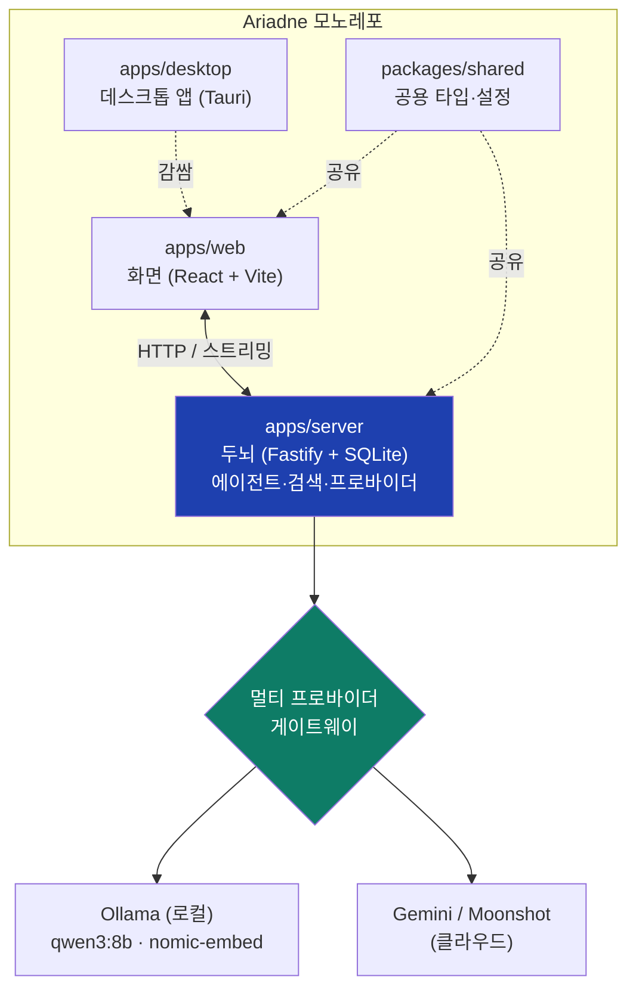

| 부분 | 역할 | 핵심 기술 |
|---|---|---|
| `apps/server` | 두뇌 — 에이전트 루프, 검색, LLM 호출, DB | **Fastify**(웹서버), **node:sqlite**(DB), **tree-sitter**(코드 파싱) |
| `apps/web` | 화면 — 채팅 UI, 설정, 워크스페이스 | **React 18**, **Vite**, **Tailwind v4** |
| `apps/desktop` | 데스크톱 앱 포장 | **Tauri**(Rust 기반) |
| `packages/shared` | 모두가 쓰는 타입·설정 한곳 | TypeScript |

**프로바이더 게이트웨이**: "어느 LLM을 쓸지"를 한곳에서 갈아끼웁니다. 기본은
**로컬 Ollama**(키 불필요, 내 컴퓨터에서), 필요하면 클라우드(Gemini 등). 그래서
**local-first** — 인터넷·계정 없이도 기본 동작합니다.

**데이터 흐름 한 바퀴** (채팅 한 번):

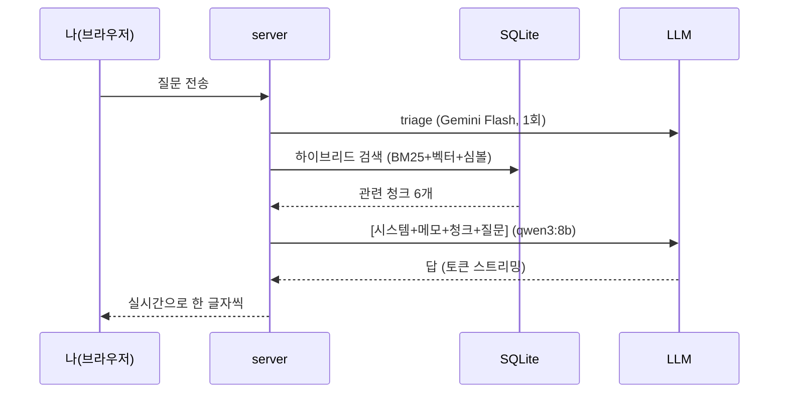

---

## 10. 좋아졌다를 증명하는 법 — eval 하네스

여기가 Ariadne의 진짜 차별점입니다. 검색을 바꿀 때마다 *"좋아진 것 같아"* 가
아니라 **숫자로** 증명합니다.

**eval 하네스 = 채점 시스템.** 구성:

- **골든셋(golden set)**: "이 질문엔 이 파일이 정답" 이라고 사람이 적어둔 정답지
  (`eval/cases/retrieval.yaml`, 35개 케이스 + 4종 테스트 워크스페이스).
- **지표(metric)**: 모의고사 점수 같은 것.
  - **Hit@1 / Hit@6** — 정답이 1등에 있나 / 상위 6등 안에 있나.
  - **MRR** — 정답이 평균 몇 등에 오나(1등=1.0, 2등=0.5…). 순위 품질.
- **CI 게이트**: 기준 미달이면 경고.

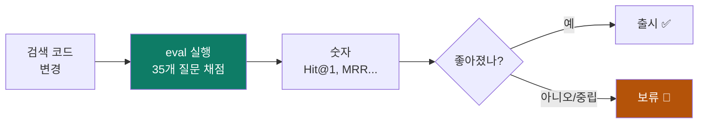

**원칙: "증명 전엔 출시 안 함(prove-before-ship)."** 실제 사례:

- **P1·P2**는 숫자로 좋아졌으니 출시 (Hit@1 52.9% → 82.4%, 누적 **+29.5%p**).
- **P3(코드 AST 청킹)** 은 리서치가 강력 추천했지만, 우리 채점에선 하이브리드
  경로에 **효과 0** 이었습니다(하이브리드의 BM25·심볼이 이미 보정). 그래서
  *연구가 추천해도* **출시 안 하고 보류**했습니다. "느낌"이 아니라 "받침"으로
  판단한 것.

이 채점 루프가 있으면, 어떤 변경도 *"이만큼 좋아졌다(또는 안 좋아졌다)"* 를
**표의 한 줄**로 말할 수 있습니다. 그게 없으면 전부 느낌일 뿐입니다.

---

## 11. 용어 사전

| 용어 | 한 줄 설명 |
|---|---|
| **LLM** | 다음 단어를 확률로 맞히는 거대한 글 생성기 |
| **토큰(token)** | LLM이 다루는 글자 덩어리 단위(대략 단어 일부). 길이·비용의 단위 |
| **환각(hallucination)** | 모르면서 그럴듯하게 지어낸 답 |
| **RAG** | 답 전에 관련 자료를 찾아 같이 주는 것(오픈북) |
| **청크(chunk)** | 검색을 위해 자른 자료 조각(Ariadne 기본 ~800자) |
| **임베딩(embedding)** | 문장의 뜻을 숫자 좌표(벡터)로 바꾼 것 |
| **코사인 유사도** | 두 벡터가 얼마나 같은 방향인지(=뜻이 비슷한지) 재는 자 |
| **BM25** | 단어 빈도·희소성으로 점수 내는 고전 키워드 검색 |
| **하이브리드 / RRF** | 키워드+의미+심볼을 순위로 합치는 검색 |
| **컨텍스트 창** | LLM이 한 번에 보는 글의 양(작업기억) |
| **하네스/에이전트** | 계획→실행→재계획으로 LLM을 묶어 일 시키는 골격 |
| **triage** | 매 메시지를 어떻게 처리할지 빠르게 분류 |
| **compaction** | 긴 대화를 구조화 요약으로 접기 |
| **라우팅** | 일 난이도별로 다른 모델에 배정 |
| **eval / 골든셋** | 변경을 숫자로 채점하는 시스템·정답지 |
| **Hit@k / MRR** | 정답이 상위 k 안에 있나 / 평균 몇 등인가 |
| **local-first** | 클라우드 없이 내 컴퓨터에서 기본 동작 |

---

## 더 읽을거리 (이 레포 안 문서)

- `docs/RAG_HARNESS.md` — 검색/평가 하네스의 설계 + 작업 기록(BATCH-NOTES).
- `docs/HARNESS_SPEED_INTELLIGENCE.md` — 속도·지능 튜닝(컨텍스트 엔지니어링) 계획.
- `docs/AGENT_INTERNALS.md` / `docs/AGENT_REFACTOR_PLAN.md` — 에이전트 내부.
- `docs/ARCHITECTURE.md` — 레포 전체 구조.
- `docs/HOW_TO_USE.md` — 설치·사용법(로컬 ollama 튜닝 포함).

> 다음 장(짝꿍 PPT)은 이 내용을 **그림 위주**로, 한 슬라이드에 한 개념씩
> 애니메이션과 함께 보여줍니다. 큰 그림이 잡히면 이 문서로 돌아와 깊게 읽으세요.
