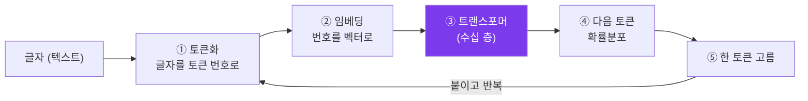
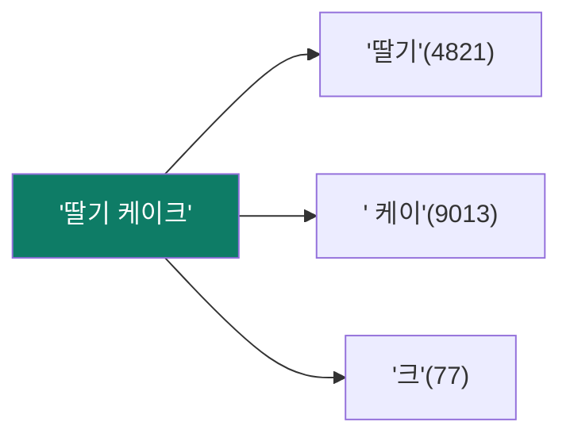
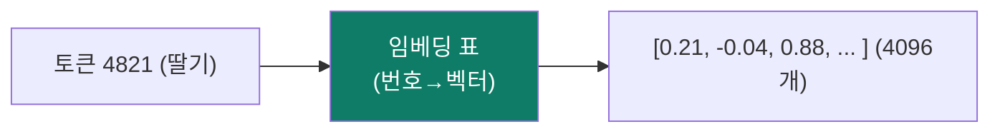
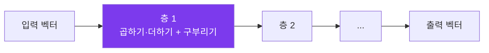
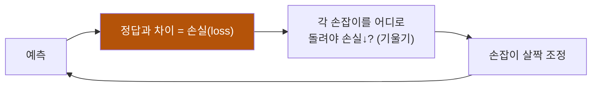
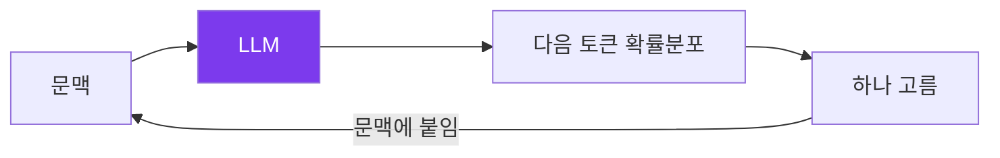
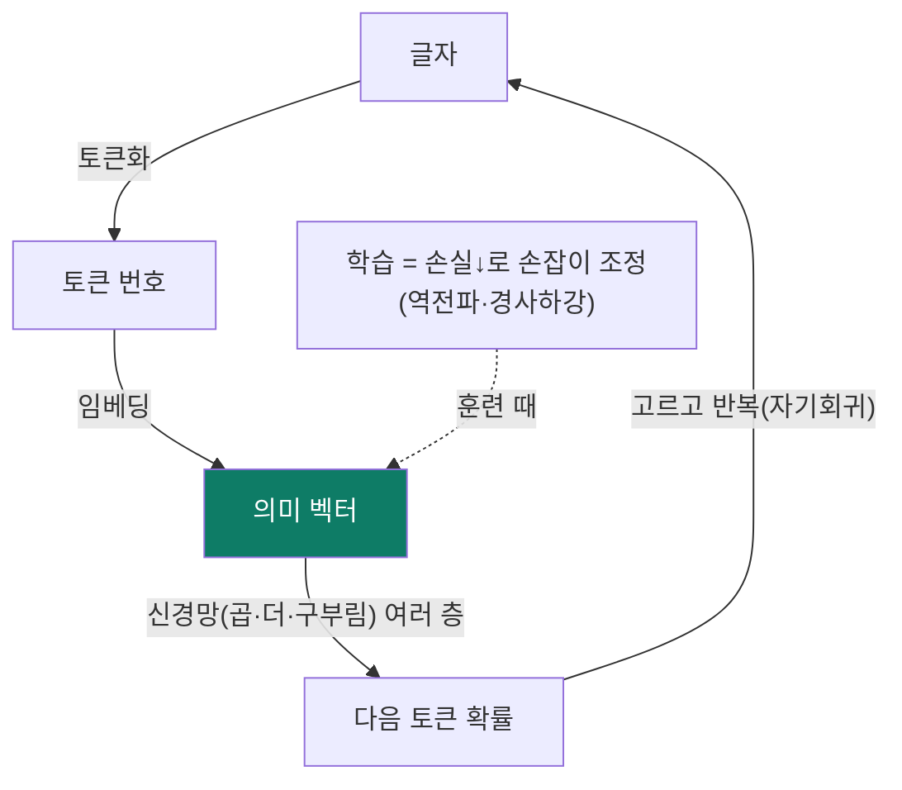

# ① 기초 — 토큰·임베딩·신경망·확률

> 목표: "LLM은 무엇을 입력받아, 내부에서 무엇을 다루고, 무엇을 내놓나"를
> 바닥부터 이해합니다. 여기만 잡으면 나머지 모듈이 쉬워집니다.

---

## 1.1 큰 그림 — LLM은 함수다

수학의 "함수"는 입력을 넣으면 출력이 나오는 상자입니다. LLM도 결국 거대한 함수
하나입니다:



- **입력**: 글자(텍스트).
- **출력**: "다음에 올 토큰"에 대한 **확률분포**(= 모든 후보 토큰에 매긴 점수).
- 그중 하나를 골라 붙이고, 또 함수를 돌리고… 반복하면 문장이 됩니다.

이 모듈은 ①토큰화 ②임베딩, 그리고 ③의 재료인 "신경망"의 기초를 다룹니다.
③ 트랜스포머 자체는 다음 모듈입니다.

---

## 1.2 토큰화 — 글자를 "토큰 번호"로

컴퓨터는 글자를 직접 못 다룹니다. 숫자만 압니다. 그래서 먼저 텍스트를 **토큰**
이라는 조각으로 쪼개고, 각 토큰에 **번호**를 붙입니다. 이 사전을
**어휘(vocabulary)** 라고 합니다(보통 5만~20만 개).

비유: **레고 부품 번호표.** "strawberry"를 통째로 외우는 대신 `straw`+`berry`
처럼 자주 쓰는 조각으로 나눠 번호를 붙입니다.



핵심 사실:

- **토큰 ≠ 단어.** 영어는 대략 1토큰 ≈ 0.75단어. 한국어·코드는 더 잘게
  쪼개져서 토큰이 더 많이 듭니다(= 더 비싸고 컨텍스트를 더 먹음).
- 흔한 방식은 **BPE(Byte Pair Encoding)**: 자주 같이 등장하는 글자쌍을 점점
  하나의 토큰으로 묶어 사전을 만듭니다.
- 그래서 "strawberry에 r이 몇 개?" 같은 **글자 단위 질문**에 LLM이 약합니다 —
  모델은 글자가 아니라 토큰 덩어리로 보기 때문입니다.

> **비용·길이의 단위가 토큰인 이유:** API 요금, 컨텍스트 창, 속도 모두 "토큰
> 개수"로 셉니다. "한글이 영어보다 토큰을 더 먹는다"는 한국어 사용자에게 실제
> 비용·성능 차이로 이어집니다.

---

## 1.3 임베딩 — 토큰 번호를 "의미 벡터"로

토큰 번호(4821)는 그냥 식별자라 의미가 없습니다. "딸기(4821)"와 "사과(4822)"가
번호상 옆이라고 뜻이 가까운 건 아니죠. 그래서 각 토큰 번호를 **벡터**(숫자 목록,
예: 4096개)로 바꿉니다. 이게 **임베딩**입니다.



- 이 벡터는 **학습으로 정해집니다**(처음엔 무작위, 훈련하며 의미를 담게 됨).
- 학습이 끝나면, **뜻이 비슷한 토큰은 벡터가 가까워집니다.** "왕−남자+여자 ≈
  여왕" 같은 의미 산수가 성립할 정도로요.
- 벡터의 길이(차원 수, 예: 768·4096·12288)가 클수록 더 섬세한 의미를 담지만
  계산·메모리가 늘어납니다.

> 임베딩은 LLM 내부용만이 아닙니다. **문장 전체의 임베딩**(한 문장 = 한 벡터)은
> RAG의 "의미 검색"에 쓰입니다 — 모듈 ⑤에서 다시 나옵니다.

---

## 1.4 신경망 — "숫자 손잡이"를 돌려 함수를 빚다

트랜스포머도 **신경망(neural network)**의 일종입니다. 신경망의 정체를 한 번에
이해합시다.

**한 줄 정의:** 신경망 = "입력 벡터에 **곱하고 더하고**(행렬 곱), 중간에
**구부리기**(비선형 함수)를 여러 층 쌓은 거대한 함수." 그 곱셈에 쓰이는 숫자들이
**파라미터(가중치)** 이고, 학습이란 이 숫자들을 좋게 맞추는 일입니다.



비유: **수천 개 손잡이가 달린 거대한 믹싱 콘솔.** 처음엔 손잡이가 아무렇게나
맞춰져 엉터리 소리(출력)가 납니다. 정답과 비교해 "이 손잡이를 살짝 이쪽으로"를
수십억 번 반복하면, 어느새 멋진 소리가 납니다.

- **파라미터 수("8B", "70B", "405B")** = 손잡이 개수. 많을수록 표현력이 크지만
  훈련·구동 비용이 큽니다.
- **"구부리기"(비선형 활성함수)** 가 핵심입니다. 곱하고 더하기만 하면 아무리
  층을 쌓아도 결국 직선 하나라 복잡한 패턴을 못 만듭니다. 중간중간 구부려야
  곡선·논리를 표현할 수 있습니다.

### 학습은 어떻게? — 경사하강과 역전파 (직관만)



- **손실(loss):** 예측이 정답에서 얼마나 빗나갔나를 숫자 하나로.
- **기울기(gradient):** "각 손잡이를 어느 방향으로 돌리면 손실이 줄까"를 미적분
  (**역전파, backpropagation**)으로 한 번에 계산.
- **경사하강(gradient descent):** 그 방향으로 손잡이를 아주 조금 옮긴다. 이걸
  데이터에 대고 어마어마하게 반복 = 학습.

비유: **안개 낀 산에서 가장 낮은 골짜기로 내려가기.** 발밑 경사(기울기)를 느껴
가장 가파른 내리막으로 한 걸음씩. 손실이 그 "높이"입니다.

> 이 한 문단이 모든 딥러닝의 엔진입니다. GPT든 이미지 생성이든, "손실을 정의하고
> 역전파로 기울기를 구해 경사하강한다"는 똑같습니다. 다른 건 **무엇을 손실로
> 삼느냐**뿐입니다. (LLM의 손실 = 다음 토큰 예측 오류 — 모듈 ③.)

---

## 1.5 언어모델 = 확률 기계

이제 LLM의 정체가 또렷해집니다. **언어모델은 "다음 토큰의 확률분포"를 내놓는
신경망**입니다.

```
입력: "아침에 일어나서 나는"
출력(확률):  커피를 0.31 | 세수를 0.18 | 학교에 0.09 | ... (어휘 전체에 점수)
```

- 마지막 층이 **어휘 크기만큼의 점수**를 내고, **softmax**라는 함수가 그걸 합이
  1인 확률로 바꿉니다.
- 답을 "생성"한다는 건, 이 확률에서 토큰을 하나 **고르고**(모듈 ④의 디코딩),
  붙이고, 다시 모델을 돌리는 **자기회귀(autoregressive)** 반복입니다.



> **왜 같은 질문에 답이 매번 다를까?** 확률에서 "뽑기"를 하기 때문(특히
> temperature가 높을 때). 0으로 두면 항상 1등만 골라 거의 똑같이 답합니다. (모듈 ④)

---

## 1.6 마법처럼 보이는 것 — In-Context Learning

LLM의 신기한 점: **추가 학습(손잡이 조정) 없이도**, 프롬프트 안에 예시 몇 개만
보여주면 새 작업을 곧잘 합니다. 이걸 **인컨텍스트 러닝(in-context learning)**,
예시를 주는 걸 **few-shot 프롬프팅**이라 합니다.

```
입력:
  영어→한국어
  dog → 개
  cat → 고양이
  apple →        ← 모델이 "사과"를 내놓음 (배운 적 없는 패턴인데도)
```

- 이건 파라미터를 바꾸는 "진짜 학습"이 아니라, **문맥을 보고 패턴을 즉석에서
  흉내**내는 것. 그래서 "유사 학습"입니다.
- 왜 가능한가? 트랜스포머의 어텐션이 "예시들 사이의 규칙"을 문맥에서 읽어내기
  때문 — 다음 모듈의 핵심입니다.

> **프롬프트 엔지니어링**의 토대가 바로 이것입니다. 모델을 재훈련하지 않고도,
> 입력을 잘 짜면 행동이 달라집니다(모듈 ⑤).

---

## 한 장 정리



- LLM = 글자를 토큰→벡터로 바꿔, 신경망으로 섞어, 다음 토큰 확률을 내는 함수.
- 학습 = 다음 토큰 예측 오류(손실)를 역전파·경사하강으로 줄이며 파라미터 조정.
- in-context learning = 재학습 없이 문맥 예시로 새 패턴을 흉내.

**다음:** 그 "신경망으로 섞는" 부분의 정체 — [② 트랜스포머](02-transformer.md).
어텐션 하나만 제대로 잡으면 LLM의 절반은 이해한 겁니다.
