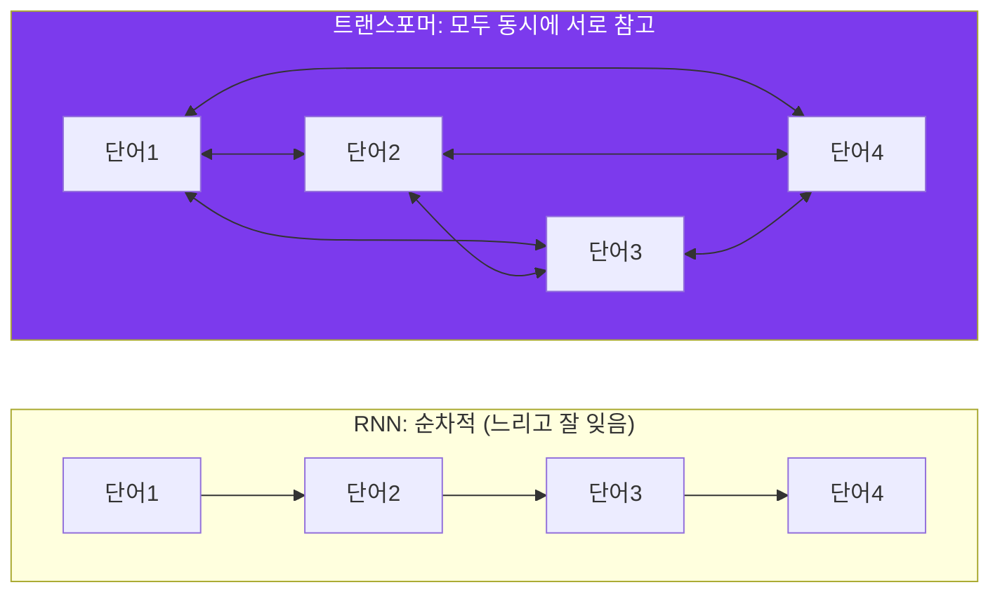
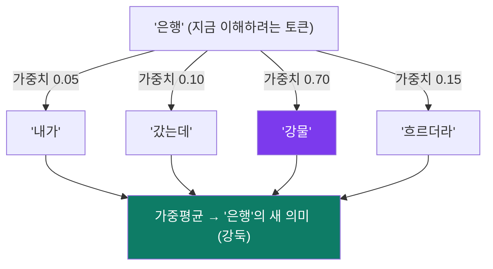
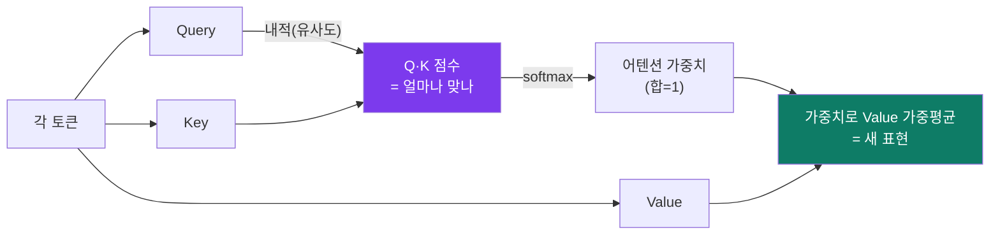
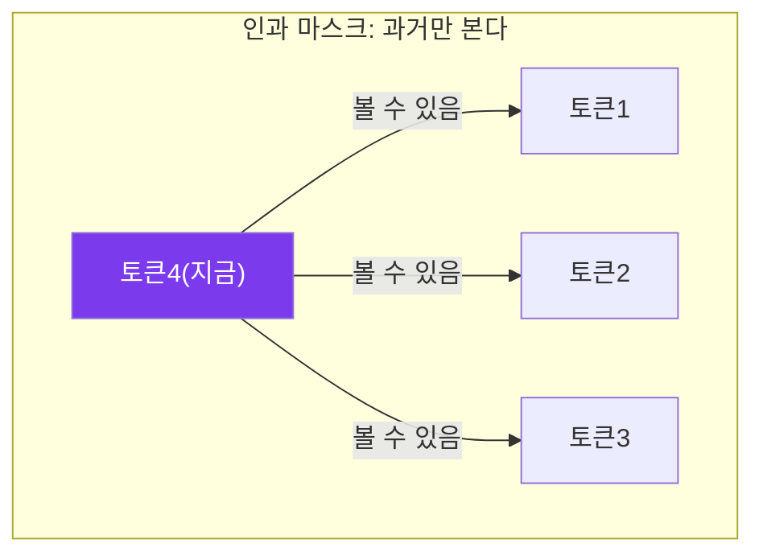
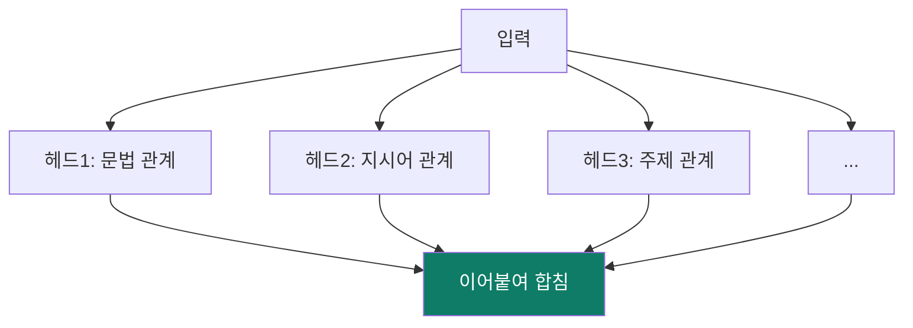
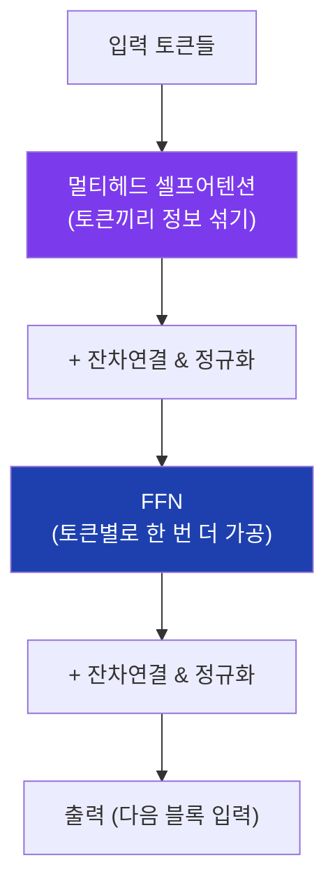
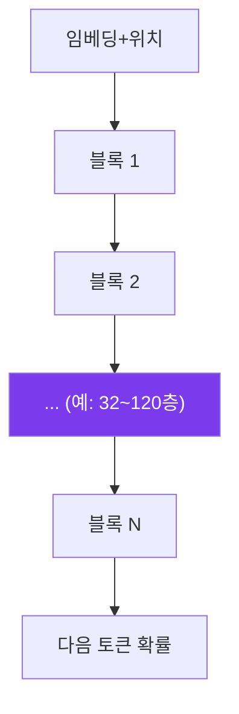
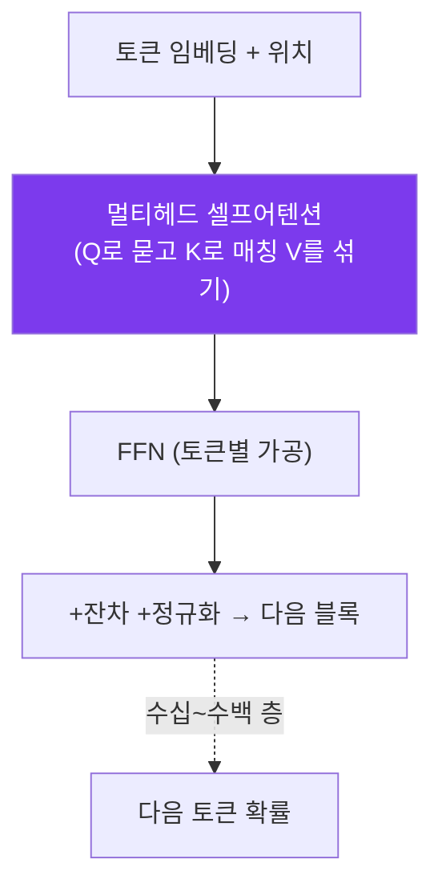

# ② 트랜스포머 — 어텐션이 전부다

> 목표: LLM의 심장인 **어텐션(attention)**을 직관으로 완전히 잡습니다. 수식은
> 최소화하되 "왜 이게 마법인지"는 빠짐없이. 이 모듈이 코스의 정점입니다.

---

## 2.1 왜 트랜스포머가 이겼나 — 예전 방식의 한계

문장을 이해하려면 "멀리 떨어진 단어 사이의 관계"를 알아야 합니다.

> "내가 **은행**에 갔는데 거기 **강물**이 흐르더라" → 여기 '은행'은 돈 은행이
> 아니라 강**둑**. 이걸 알려면 '은행'이 뒤의 '강물'을 **참고**해야 합니다.

예전 모델 **RNN**은 문장을 **한 단어씩 순서대로** 읽으며 기억을 누적했습니다.
문제:

1. **순차적이라 느림** — 단어를 동시에 처리 못 함(병렬화 불가).
2. **먼 관계를 잊음** — 앞 단어 기억이 뒤로 갈수록 흐려짐(장거리 의존성 약함).



**2017년 트랜스포머**("Attention Is All You Need")의 아이디어: 순서대로 읽지 말고,
**모든 단어가 모든 단어를 한 번에 서로 참고**하게 하자. 이게 어텐션이고, 덕분에
(1) 병렬 처리로 빠르고 (2) 아무리 먼 단어도 직접 참고합니다.

---

## 2.2 어텐션의 직관 — "누구를 얼마나 볼까"

어텐션의 본질은 한 문장입니다:

> **각 토큰이, 다른 모든 토큰을 "얼마나 참고할지" 가중치를 매기고, 그 가중치로
> 다른 토큰들의 정보를 섞어 자기 표현을 갱신한다.**

'은행' 토큰이 자신을 이해하려고 문장을 둘러봅니다. '강물'에 높은 가중치(0.7),
'갔는데'에 낮은 가중치(0.05)… 그리고 그 가중치로 다른 토큰 정보를 가중평균해
"아, 나는 강둑 은행이구나"로 자기 의미를 업데이트합니다.



---

## 2.3 Query·Key·Value — 도서관 비유

그럼 가중치는 어떻게 정할까요? 트랜스포머는 각 토큰에서 **세 가지 벡터**를
만듭니다(임베딩에 서로 다른 가중치 행렬을 곱해서):

| 이름 | 비유 | 역할 |
|---|---|---|
| **Query (질의)** | "내가 찾는 것" 메모 | 지금 토큰이 무엇을 알고 싶은가 |
| **Key (열쇠)** | 책 표지의 "주제 태그" | 각 토큰이 "나는 이런 정보 있음"을 광고 |
| **Value (값)** | 책의 실제 내용 | 참고될 때 실제로 전달되는 정보 |

**도서관 비유:** 나(Query)는 "강 관련 정보 찾아요"라는 메모를 들고, 책마다 붙은
주제 태그(Key)와 대조합니다. 태그가 잘 맞는 책일수록 높은 점수. 그 점수로 책
내용(Value)을 가중치 있게 빌려와 섞습니다.



수식으로는 딱 한 줄(겁먹지 마세요, 위 그림 그대로입니다):

```
Attention(Q, K, V) = softmax( Q·Kᵀ / √d ) · V
```

- `Q·Kᵀ` = 모든 토큰쌍의 "질의-열쇠 일치 점수"(내적 = 유사도).
- `/√d` = 점수가 너무 커지지 않게 크기 보정(안정화).
- `softmax` = 점수를 합 1인 **가중치**로.
- `· V` = 그 가중치로 **Value를 가중평균**.

> 이 한 줄이 LLM의 거의 전부입니다. "Q로 묻고, K로 매칭 점수 내고, softmax로
> 가중치 만들어, V를 섞는다."

---

## 2.4 Self-attention vs 그냥 attention

LLM은 **self(자기)-attention**을 씁니다 — Query·Key·Value를 **같은 문장의
토큰들**에서 뽑습니다. 즉 문장이 자기 자신을 들여다보며 내부 관계를 파악합니다.
(번역기처럼 다른 문장을 참고하면 cross-attention.)

**인과(causal) 마스크:** GPT 같은 생성 모델은 "다음 단어 맞히기"가 일이라,
미래 토큰을 미리 보면 반칙입니다. 그래서 **각 토큰은 자기 이전 토큰만** 보도록
가립니다(미래에 0 가중치). 이게 "decoder-only / autoregressive"의 핵심.



---

## 2.5 Multi-Head — 여러 관점으로 동시에 보기

한 가지 어텐션만 쓰면 "한 종류의 관계"만 봅니다. 트랜스포머는 어텐션을 **여러
개 병렬로(헤드, head)** 둡니다. 각 헤드가 서로 다른 관계를 전담합니다.

비유: **한 문장을 여러 전문가가 동시에 분석.** 한 헤드는 문법(주어-동사), 다른
헤드는 지시어(이것=무엇), 또 다른 헤드는 장거리 주제 연결… 그 결과를 합칩니다.



---

## 2.6 위치 인코딩 — 순서를 어떻게 알려주나

어텐션은 "모두가 모두를 본다"라 **순서 정보가 없습니다**("나는 너를 안다"와
"너는 나를 안다"를 구분 못 함). 그래서 각 토큰 임베딩에 **위치 정보**를 더해
줍니다 — **위치 인코딩(positional encoding)**.

- 초기엔 사인·코사인 패턴을 더했고, 요즘 모델은 **RoPE(회전 위치 인코딩)** 를
  많이 씁니다(상대 위치를 잘 표현 + 긴 문맥에 유리).
- 위치 인코딩 방식이 **긴 컨텍스트 창**(100K~1M 토큰)을 가능케 한 핵심 기술 중
  하나입니다(모듈 ④).

---

## 2.7 트랜스포머 블록 — 어텐션 + FFN + 잔차 + 정규화

어텐션은 "토큰끼리 정보를 섞는" 단계입니다. 그 뒤에 **FFN(피드포워드 신경망)**
이 각 토큰을 개별적으로 한 번 더 가공합니다. 이 둘에 **잔차연결(residual)**과
**정규화(layer norm)** 를 붙인 게 **트랜스포머 블록** 한 개입니다.



- **잔차연결("+ 입력 그대로 더하기")**: 깊게 쌓아도 학습이 안 망가지게 하는 핵심
  장치. 정보가 지름길로 흐릅니다.
- **정규화(layer norm)**: 숫자 크기를 일정하게 유지해 학습을 안정화.
- **FFN**: 어텐션이 "관계", FFN이 "각 토큰의 개별 변형/지식 저장" 역할. 사실
  파라미터의 대부분은 FFN에 있습니다.

### 그리고 이 블록을 수십~수백 층 쌓는다



층이 깊어질수록 표현이 추상화됩니다 — 아래층은 문법·구문, 위층은 의미·추론에
가까운 패턴을 다룬다고 알려져 있습니다. "GPT-3 = 96층, 1750억 파라미터" 식.

---

## 2.8 GPT 계열 vs BERT 계열 (decoder vs encoder)

같은 트랜스포머라도 쓰임이 갈립니다:

| | **Decoder-only (GPT 계열)** | **Encoder-only (BERT 계열)** |
|---|---|---|
| 본다 | 과거만 (인과 마스크) | 양방향 전체 |
| 일 | **다음 토큰 생성** | 문장 **이해**(분류·임베딩) |
| 예 | GPT, Claude, Gemini, Llama, Qwen | BERT, **임베딩 모델(nomic-embed)** |

> 오늘날 "LLM"이라 하면 대부분 **decoder-only 생성 모델**입니다. 하지만 RAG의
> 검색에 쓰는 **임베딩 모델**은 encoder 계열인 경우가 많습니다(모듈 ⑤). 둘 다
> 트랜스포머라는 한 뿌리.

---

## 한 장 정리



- 어텐션 = "각 토큰이 Q로 묻고, 다른 토큰의 K와 맞춰 가중치를 내고, 그 가중치로
  V를 섞어 자기 의미를 갱신". `softmax(Q·Kᵀ/√d)·V` 한 줄.
- 멀티헤드 = 여러 관점 동시에. 위치인코딩 = 순서 주입. FFN = 토큰별 가공.
- 이 블록을 깊게 쌓은 게 GPT. 어텐션 하나를 잡으면 절반은 끝.

**다음:** 이 구조에 **어떻게 지식을 채우고, 어떻게 말을 잘 듣게 만드나** —
[③ 학습·정렬](03-training-alignment.md).
