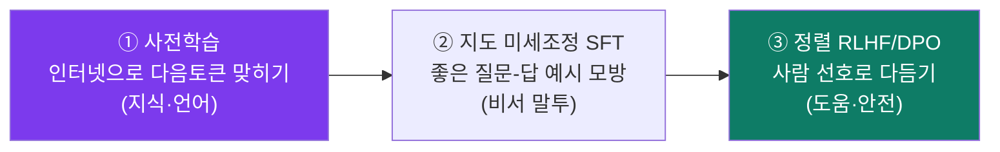
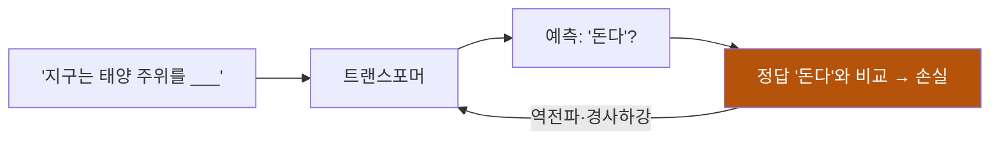
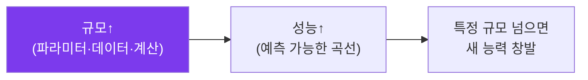
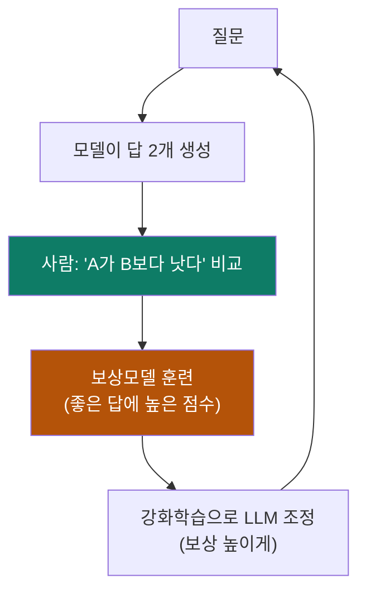
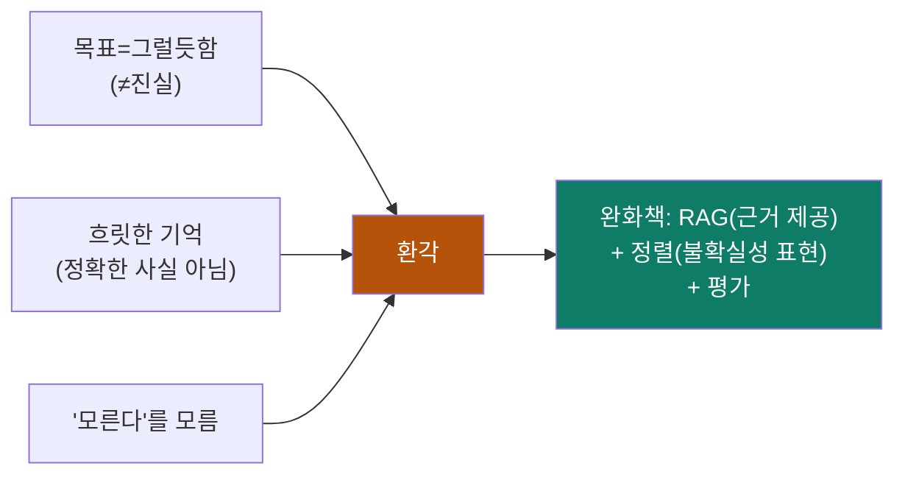
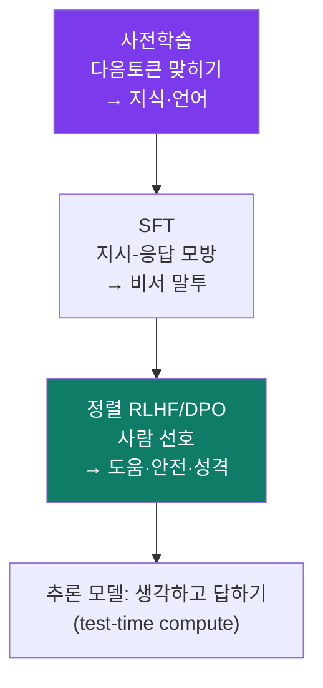

# ③ 학습·정렬 — 똑똑해지기 & 말 잘 듣게 되기

> 목표: 빈 트랜스포머(랜덤 손잡이)가 어떻게 (1) 세상 지식을 얻고 (2) 사람 말을
> 잘 듣는 비서가 되는지. 그리고 **환각**이 왜 본질적으로 생기는지.

LLM 만들기는 보통 3단계입니다:



---

## 3.1 사전학습(Pretraining) — 지식은 여기서 온다

**한 줄:** 인터넷 규모의 텍스트(수조 토큰)로 **다음 토큰 맞히기**를 무지막지하게
반복. 손실 = 다음 토큰 예측 오류(모듈 ①의 경사하강).



왜 이게 "지식"이 되나? **다음 토큰을 잘 맞히려면 세상을 알아야 하기 때문.**
"파리는 ___의 수도" 빈칸을 맞히려면 지리를, 코드 다음 줄을 맞히려면 프로그래밍을
배워야 합니다. 그래서 단순한 목표(다음 토큰)가 부수적으로 방대한 지식·문법·추론
패턴을 학습하게 만듭니다.

- **데이터:** 웹·책·코드·논문 등을 정제·중복제거·필터링한 거대 코퍼스. 데이터
  품질이 성능을 크게 좌우합니다("쓰레기를 넣으면 쓰레기가 나온다").
- **비용:** 수천~수만 개 GPU로 수주~수개월. 큰 모델 1회 사전학습에 수백만~수천만
  달러. 그래서 사전학습은 소수 거대 기업/연구소만 합니다.
- 이 단계의 산출물을 **base 모델(foundation model)** 이라 합니다 — 똑똑하지만
  아직 "비서"는 아닙니다(질문에 답하기보다 텍스트를 이어쓰려 함).

---

## 3.2 스케일링 법칙 & 창발 — 키우면 똑똑해진다

**스케일링 법칙(scaling laws):** 모델 크기(파라미터)·데이터·계산량을 늘리면
성능이 **예측 가능하게** 좋아집니다(매끄러운 곡선). 이 발견이 "일단 키우자"
경쟁을 촉발했습니다.

- **Chinchilla 교훈(2022):** 무작정 모델만 키우면 비효율. **데이터도 비례해**
  늘려야 최적. "주어진 계산예산에선 적당한 크기 모델 × 충분한 데이터"가 이김.
- **창발(emergent abilities):** 어느 규모를 넘으면 작은 모델엔 없던 능력(산수·
  다단계 추론·번역)이 갑자기 나타나는 현상. (단, 일부는 측정 방식의 착시라는
  반론도 있어 — 과신 금지.)



> **"더 작은 빠른 모델은 멍청해지는 것 같다"** — 맞습니다, 규모가 줄면 능력이
> 줄어요. 그래서 Ariadne는 *쉬운 일은 작은/빠른 모델, 어려운 추론은 큰 모델*로
> 나눕니다(라우팅, 모듈 ④·⑤).

---

## 3.3 지도 미세조정(SFT) — 비서로 변신

base 모델은 "이어쓰기"만 잘합니다. "질문하면 답하는" 비서로 만들려면, **좋은
(지시→응답) 예시 수천~수십만 개**로 추가 학습합니다. 이게 **SFT(지도 미세조정)**
= **instruction tuning**.

```
지시: "광합성을 한 문장으로 설명해."
응답: "식물이 빛으로 이산화탄소와 물을 양분으로 바꾸는 과정입니다."
   ↑ 이런 예시를 모방하도록 손잡이 미세조정 → 질문에 답하는 말투 습득
```

- 데이터는 사람이 작성하거나, 더 큰 모델로 생성(합성 데이터)합니다.
- 효과: 말투·형식·"질문에 답한다"는 행동을 입힘. 단, "무엇이 더 좋은 답인가"의
  미묘함까지는 부족 → 다음 단계.

---

## 3.4 정렬(RLHF/DPO) — 사람 선호로 다듬기

같은 질문에도 답은 여럿. 어느 게 더 도움 되고 안전한지를 **사람 선호**로
가르칩니다. 대표 방법 **RLHF(사람 피드백 강화학습):**



1. 사람이 답들을 **비교**해 선호 데이터를 만든다.
2. 그 선호로 **보상모델(reward model)** 을 훈련(좋은 답 = 높은 점수).
3. 그 보상을 높이도록 LLM을 **강화학습(PPO 등)** 으로 미세조정.

- **DPO(직접 선호 최적화):** 보상모델·강화학습 없이 선호쌍으로 바로 최적화하는
  더 간단·안정적인 최신 대안. 요즘 많이 씁니다.
- **이게 "성격"을 만든다:** ChatGPT/Claude의 정중함·거절·안전성·형식이 대부분
  이 단계 산물. 같은 base라도 정렬을 어떻게 하느냐로 제품 색이 갈립니다.

> **정렬의 그늘:** 너무 맞추면 아첨(sycophancy)·과도한 거절이 생깁니다. "도움 ↔
> 안전 ↔ 정직"의 균형이 정렬의 핵심 난제입니다.

---

## 3.5 추론 모델(Reasoning) — "생각하고 답하기"

2024~2026의 큰 흐름: 답을 바로 뱉지 않고 **속으로 단계적으로 생각(chain-of-
thought)** 한 뒤 답하는 모델(OpenAI o1/o3, DeepSeek-R1 류).


- 어떻게? **추론 과정 자체에 강화학습**으로 보상(맞는 풀이에 +). 모델이 "더
  오래·체계적으로 생각하면 더 잘 푼다"를 학습.
- **test-time compute(추론 시 계산):** 답할 때 생각을 더 많이 시킬수록(토큰 더
  씀) 성능↑. "크기"만이 아니라 "생각 시간"으로도 똑똑해지는 새 축.
- 대가: 느리고 비쌈(토큰 많이 씀). 그래서 쉬운 질문엔 안 씀.

> Ariadne의 "에이전트/Deep 모드"(계획→실행→재계획)는 *하네스 레벨*에서 비슷한
> 효과를 냅니다 — 모델 안이 아니라 바깥에서 여러 단계를 밟게(모듈 ⑤).

---

## 3.6 환각은 왜 생기나 — 본질적 이유

**환각(hallucination)** = 모르면서 그럴듯하게 지어내는 것. 버그가 아니라 **설계의
필연적 부작용**입니다:

1. **목표가 "그럴듯함"이지 "진실"이 아니다.** 사전학습 손실은 "다음 토큰을
   그럴듯하게" 맞히는 것. 진실 여부를 직접 채점하지 않습니다.
2. **모델은 "모른다"를 잘 모른다.** 빈칸은 무조건 채우게 훈련됨 → 자신감 있게 틀림.
3. **지식이 흐릿한 기억으로 압축돼 있다.** 정확한 출처가 아니라 통계적 패턴.



**완화책(없애기 아니라 줄이기):** ① **RAG** — 진짜 자료를 보여줘 추측 대신
복사하게(모듈 ⑤). ② **정렬** — "모르면 모른다고" 학습. ③ **도구** — 계산기·검색
으로 사실 위임. ④ **평가** — 환각률을 측정해 관리(모듈 ⑥).

---

## 한 장 정리



- 지식 = 사전학습(다음 토큰)에서. 비서화 = SFT. 성격·안전 = 정렬(RLHF/DPO).
- 키우면 예측 가능하게 똑똑해짐(스케일링 법칙) + 데이터도 비례해야(Chinchilla).
- 추론 모델 = 생각을 더 시켜 성능↑(새로운 축). 환각 = 목표가 진실이 아니라
  그럴듯함이라 생기는 필연 → RAG·정렬·도구·평가로 완화.

**다음:** 다 만든 모델을 **어떻게 빠르고 싸게 돌리나** —
[④ 추론·효율](04-inference-efficiency.md).
