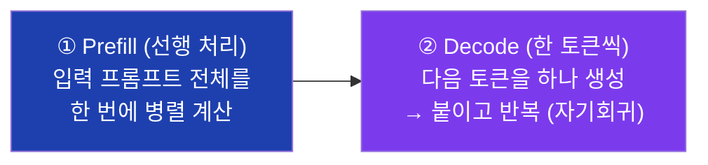
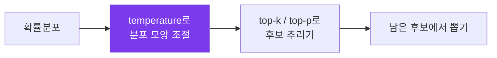
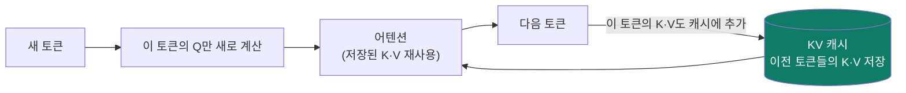
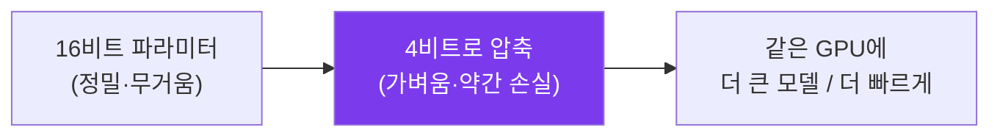
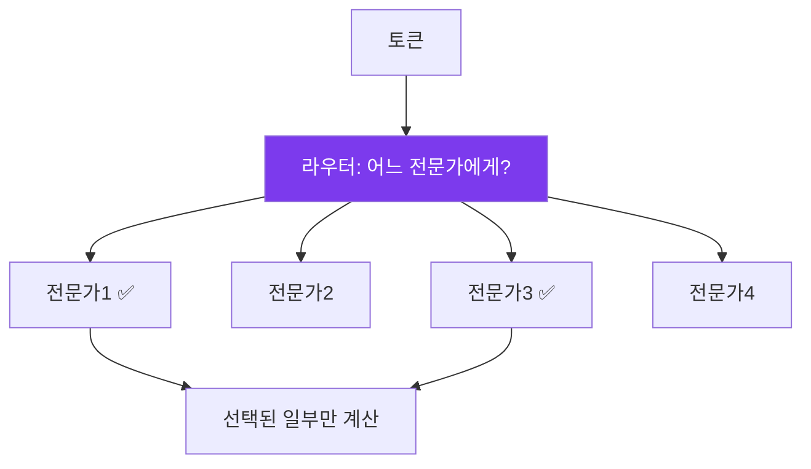
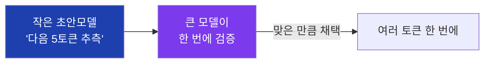
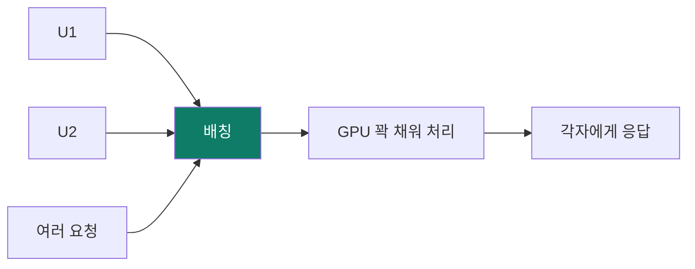
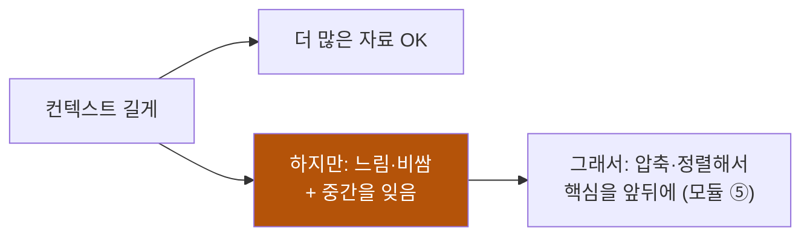
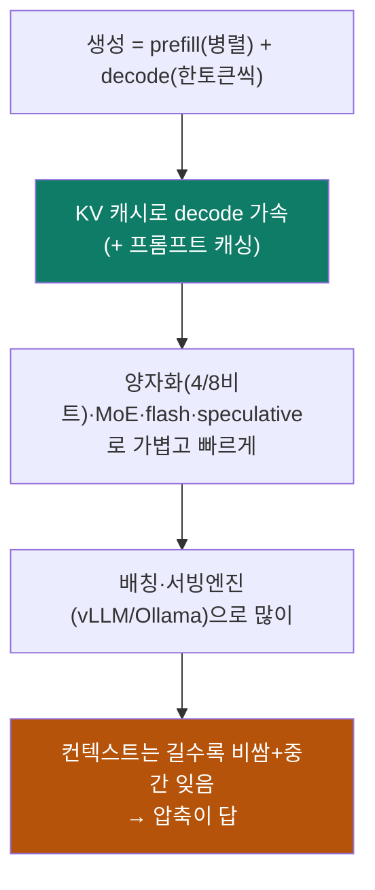

# ④ 추론·효율 — 빠르고 싸게 돌리기

> 목표: 학습 끝난 모델로 **실제 답을 생성(inference)** 할 때 무슨 일이 벌어지고,
> 왜 느리고 비싼지, 그걸 어떻게 줄이는지. 속도·비용은 제품의 생사입니다.

---

## 4.1 생성의 두 단계 — prefill과 decode

답을 만들 때 LLM은 두 국면을 거칩니다:

- **Prefill:** 긴 입력을 한꺼번에(병렬) 처리 → 첫 토큰까지의 시간(**TTFT**)을
  좌우. 입력이 길수록 느림.
- **Decode:** 토큰을 **한 개씩** 순차 생성. 여기가 느림의 본질 — 한 토큰 만들
  때마다 수십억 파라미터를 한 번씩 읽어야 함. 출력이 길수록 느림.

> 그래서 지연은 두 숫자: **TTFT**(첫 글자까지) + **초당 토큰 수**(생성 속도).
> 아래 기법들은 대부분 이 둘을 줄이는 싸움입니다.

---

## 4.2 디코딩 전략 — 확률에서 어떻게 고르나

모델은 "다음 토큰 확률분포"를 줄 뿐, 하나를 고르는 건 별도 규칙(**디코딩**)입니다.

| 전략 | 방식 | 성격 |
|---|---|---|
| **Greedy** | 매번 1등만 | 일관적·단조·반복 위험 |
| **Temperature** | 확률을 평평/뾰족하게 | 높으면 창의·산만, 낮으면 안정·보수 |
| **Top-k** | 상위 k개 중에서만 뽑기 | 엉뚱한 후보 차단 |
| **Top-p (nucleus)** | 누적확률 p까지 후보에서 뽑기 | 상황 적응적, 가장 흔함 |

- **temperature=0** ≈ greedy(거의 결정적). 사실·코드엔 낮게, 브레인스토밍엔 높게.
- "같은 질문, 다른 답"의 정체가 바로 이 **뽑기**입니다(모듈 ①).

---

## 4.3 KV 캐시 — 속도의 핵심

decode에서 매 토큰마다, 지금까지의 **모든** 이전 토큰에 대한 어텐션을 다시
계산하면 엄청 낭비입니다. 그래서 각 토큰의 **Key·Value 벡터를 저장(캐시)** 해두고
재사용합니다. 이게 **KV 캐시**.

- 덕분에 매 토큰 계산이 "전체 다시"가 아니라 "새 토큰만 추가"가 됩니다.
- **대가: 메모리.** 문맥이 길수록 KV 캐시가 커져 GPU 메모리를 잡아먹습니다. 그래서
  긴 컨텍스트는 비싸고, KV 캐시 **양자화(q8 등)**·압축이 중요합니다.
- **프롬프트 캐싱(접두어 재사용):** 프롬프트 앞부분이 매번 같으면 그 부분의 KV를
  재활용해 prefill을 건너뜀 → 빠르고 쌈. **"앞부분을 고정하라"**(모듈 ⑤의
  컨텍스트 엔지니어링)가 여기서 옵니다.

> Ariadne가 ollama 컨텍스트를 4096→16384로 키우고 q8 KV 캐시를 쓰는 이유가
> 바로 이 메모리-품질 트레이드오프 관리입니다(레포 explainer 참고).

---

## 4.4 양자화 — 숫자를 줄여 가볍게

파라미터는 보통 16비트 실수입니다. 이걸 **8비트·4비트로 줄이면**(양자화,
quantization) 메모리·속도가 크게 좋아집니다. 품질 손실은 생각보다 작습니다.

- **GGUF / GPTQ / AWQ** = 흔한 양자화 포맷·기법. 로컬에서 "Q4_K_M" 같은 표기를
  보게 됩니다(모듈 ⑥).
- 효과: 70B 모델을 노트북에서 돌리는 게 양자화 덕분. **4비트가 품질/용량의 흔한
  스위트스폿.**

---

## 4.5 효율 3대장 — Flash Attention · MoE · Speculative Decoding

### Flash Attention
어텐션 계산을 GPU 메모리를 영리하게 써서 **더 빠르고 메모리 적게**. 결과는 동일,
구현만 똑똑. 긴 문맥을 실용적으로 만든 핵심 기술.

### MoE (Mixture of Experts, 전문가 혼합)
FFN을 **여러 '전문가' 네트워크로 쪼개고, 토큰마다 일부만** 활성화. "총
파라미터는 크지만(지식 많음), 매 토큰엔 일부만 계산(빠름)".

- 비유: **전문의 병원.** 환자(토큰)마다 필요한 과 2명만 진료. 병원 전체는 크지만
  한 환자가 만나는 의사는 소수.
- Mixtral, DeepSeek, 최신 GPT/Gemini 상당수가 MoE. "활성 파라미터 vs 총
  파라미터"가 갈리는 이유.

### Speculative Decoding (추측 디코딩)
작은 **초안 모델**이 다음 몇 토큰을 싸게 추측 → 큰 모델이 **한 번에 검증**. 맞으면
여러 토큰을 한 번 계산값으로 얻음 → **2~3배 빠름, 품질 동일(무손실).**

---

## 4.6 처리량 — 배칭과 서빙 엔진

한 사람만 쓰면 GPU가 놉니다. **배칭(batching):** 여러 요청을 묶어 동시에 처리해
GPU를 꽉 채움 → 처리량(throughput)↑, 사용자당 비용↓.

- **continuous batching**: 요청이 들고 날 때마다 묶음을 동적으로 재구성(빈자리
  바로 채움) → 효율 극대화.
- **서빙 엔진:** **vLLM**, TGI, TensorRT-LLM 등이 KV 캐시 관리(PagedAttention)·
  배칭·양자화를 묶어 "빠르게 많이" 서빙. 로컬은 **Ollama / llama.cpp**.

---

## 4.7 컨텍스트 창 — 길수록 좋기만 할까

**컨텍스트 창** = 한 번에 보는 토큰 최대치(4K~1M까지 다양). 늘리면 더 많은 자료를
넣지만:

1. **비용·지연 증가** — KV 캐시·계산이 길이에 따라 커짐(어텐션은 원래 길이²).
2. **Lost in the middle** — 길어지면 **중간 정보를 잘 못 씀**(U자형: 앞·뒤만 잘
   봄). 창을 키워도 이건 자동 해결 안 됨.

> 결론: "그냥 다 때려넣기"보다 **압축해서 핵심만 넣기**가 이깁니다. 이게 컨텍스트
> 엔지니어링(모듈 ⑤)의 존재 이유입니다.

---

## 한 장 정리

- 느림의 본질 = decode(토큰 하나씩). KV 캐시·speculative가 핵심 가속.
- 가볍게 = 양자화·MoE·flash attention. 많이 = 배칭·서빙엔진.
- 컨텍스트는 공짜가 아님(비용+lost-in-the-middle) → 압축으로 관리.

**다음:** 이렇게 잘 돌리는 모델의 **한계를 넘어 진짜 일을 시키기** —
[⑤ 증강·에이전트](05-augmentation-agents.md).
