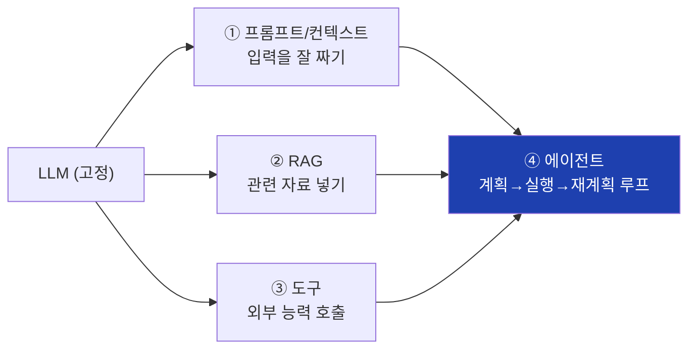
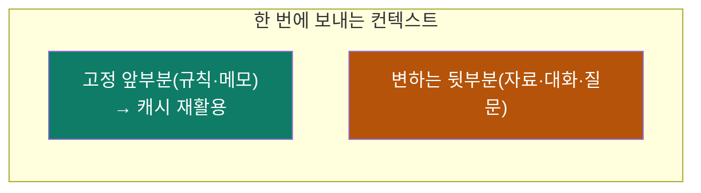
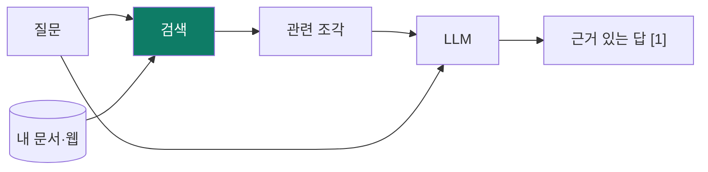
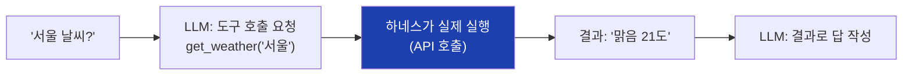
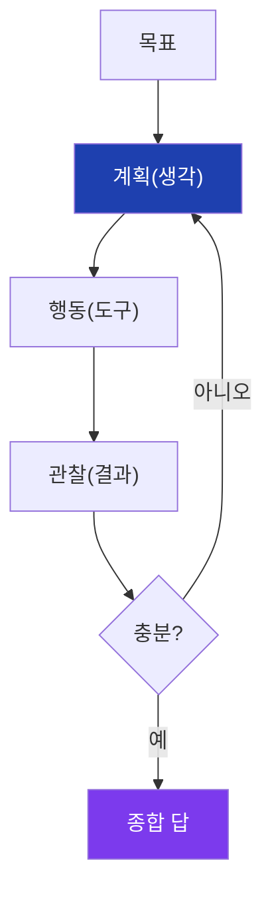
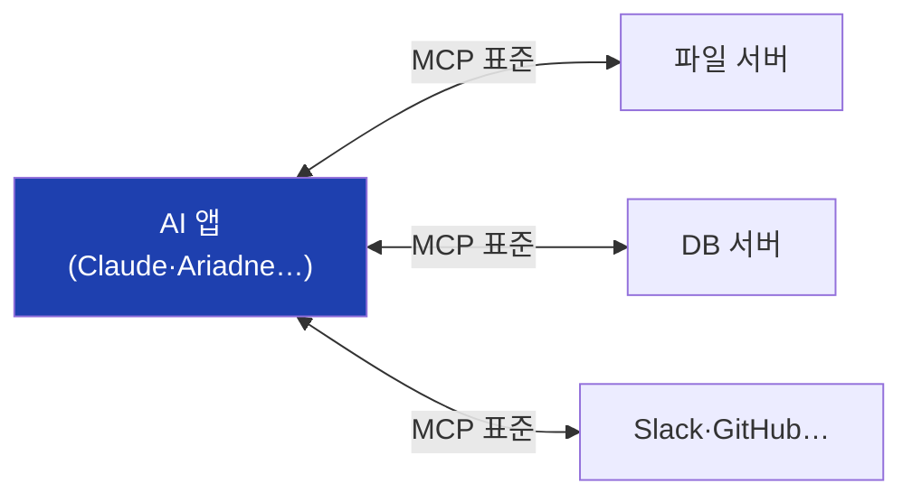
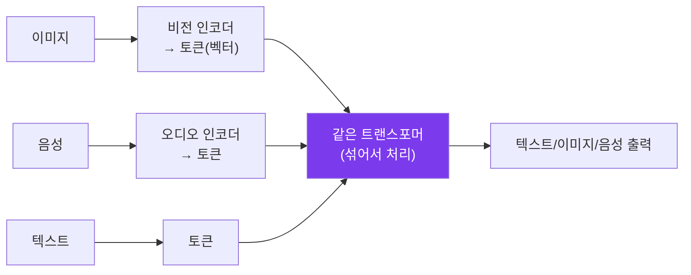
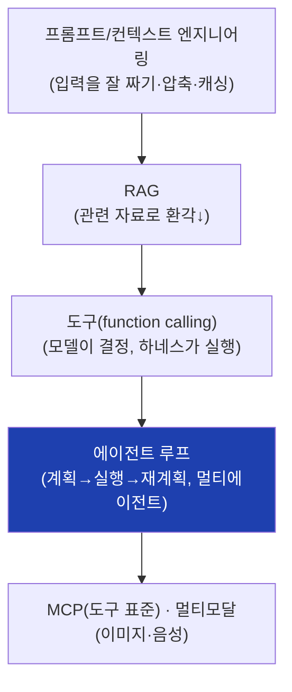

# ⑤ 증강·에이전트 — 한계를 넘어 진짜 일을 시키기

> 목표: 모델 자체(①~④)를 넘어, **바깥에서 능력을 확장**하는 기술들. 프롬프트·
> 컨텍스트 엔지니어링 → RAG → 도구 → 에이전트 → MCP → 멀티모달.
>
> 이 레포의 `01-rag-harness-explainer.md`가 RAG·하네스를 *우리 앱 기준*으로
> 자세히 다룹니다. 여기선 *일반 기술*로 정리하고 그 문서를 가리킵니다.

LLM의 3대 한계(모듈 ③): 내 자료 모름, 최신 모름, 환각. 이걸 **재학습 없이**
입력·도구·루프로 메우는 게 이 모듈입니다.

---

## 5.1 프롬프트 & 컨텍스트 엔지니어링

**프롬프트 엔지니어링** = 입력 문장을 잘 짜서 행동을 끌어내기(재학습 X). 핵심 기법:

- **역할·지시 명확화**: "너는 ~다. 다음을 하라." + 형식 지정.
- **Few-shot(예시 주기)**: 원하는 입출력 예 2~3개(모듈 ①의 in-context learning).
- **Chain-of-Thought(생각의 사슬)**: "단계별로 생각해" → 다단계 추론 정확도↑.
- **분해/스텝백**: 큰 질문을 작은 질문으로, 또는 일반 원리부터 묻기.

**컨텍스트 엔지니어링** = (프롬프트보다 넓게) *모델의 한정된 작업기억에 무엇을·
얼마나·어떤 순서로 넣을지* 설계. 모듈 ④에서 봤듯 컨텍스트는 비싸고 중간을
잊으므로:

- **압축(compaction):** 긴 대화를 구조화 요약으로 접기.
- **캐싱 친화 배치:** 안 변하는 건 앞에(KV/프롬프트 캐시 재활용 — 모듈 ④).
- **JIT 로딩:** 다 미리 넣지 말고, 식별자(경로·링크)만 두고 필요할 때 도구로 당김.

---

## 5.2 RAG — 검색 증강 생성 (요약)

**RAG** = 답 전에 관련 자료를 찾아 같이 넣기(오픈북). 환각·최신성·내 자료 문제의
1차 해법.

검색의 내부(청킹 → 임베딩 → 키워드/의미/하이브리드 RRF → 리랭킹)는
**`01-rag-harness-explainer.md` §4~6**에 그림과 함께 자세히 있습니다. 핵심만:

- **임베딩 검색(의미):** 문장을 벡터로 만들어 가까운 것 찾기. 저장소가 **벡터
  DB**(또는 우리처럼 SQLite + 코사인).
- **키워드(BM25):** 정확한 단어. **하이브리드** = 둘을 **RRF**(순위 합산)로 합쳐
  서로 약점 보완(우리가 측정으로 검증: Hit@1 +23.6%p).
- **리랭킹:** 후보를 교차인코더로 재정렬해 정밀도↑(비용 듦).
- **Contextual/Late chunking:** 조각에 문맥을 보존해 검색 품질↑.

> 한 줄: **검색을 잘하면 작은 모델도 똑똑해 보입니다.** 모델을 키우는 것보다
> 검색 파이프라인을 고치는 게 더 싸게 더 큰 효과인 경우가 많습니다.

---

## 5.3 도구 사용 (Function Calling)

LLM은 계산·실시간 검색·DB 조회를 직접 못 합니다. 대신 **"이 도구를 이런 인자로
부르고 싶다"는 구조화 출력(JSON)** 을 내게 하고, **하네스(우리 코드)가 실제로
실행**한 뒤 결과를 다시 넣어줍니다.

- **모델은 '무엇을 할지' 결정, 하네스가 '실제 실행'.** 이 분리가 안전·정확의 핵심.
- 도구 예: 웹 검색, 파일 읽기/쓰기, 코드 실행, 계산기, DB 쿼리, 캘린더…
- "도구 쓰는 LLM" = **augmented LLM**, 에이전트의 최소 단위.

---

## 5.4 에이전트 — 계획→실행→재계획 루프

한 번의 호출로 안 끝나는 일(여러 단계+도구+점검)은 **에이전트** 루프로 묶습니다.
대표 패턴 **ReAct(Reason+Act)** / plan-execute:

- **계획 → 도구 실행 → 결과 관찰 → (부족하면) 다시 계획 → … → 종합.**
- **멀티에이전트(오케스트레이터-워커):** 큰 일을 서브에이전트로 쪼개 병렬 조사 후
  합침. 각자는 요약만 반환(작업기억 절약). 대가: 토큰 多(15배까지).
- **설계 원칙(업계 합의):** *가장 단순한 것부터.* 단일 LLM+검색으로 되면 그걸로.
  에이전트 복잡도는 **평가가 정당화할 때만** 추가(지연·비용 ↔ 성능 트레이드).

> 이 레포의 하네스(triage·plan·replan·deep mode·라우팅)가 정확히 이걸 구현합니다 —
> `01-rag-harness-explainer.md` §7.

---

## 5.5 MCP — 도구의 표준 콘센트

도구를 모델마다·앱마다 따로 붙이면 난장판입니다. **MCP(Model Context Protocol)**
는 "AI 앱 ↔ 외부 도구/데이터"를 잇는 **표준 규격**입니다(USB-C에 비유).

- 한 번 MCP로 만든 도구는 MCP 지원 앱 어디서나 꽂아 씀(재사용·생태계).
- 2024~2026 빠르게 표준으로 자리잡는 중. Ariadne도 MCP 서버를 연결해 씁니다.

---

## 5.6 멀티모달 — 글자 너머(이미지·음성)

요즘 모델은 텍스트만이 아니라 **이미지·음성·영상**도 다룹니다(멀티모달).

- 비결: 이미지·음성도 **토큰(벡터)으로 변환**해 텍스트 토큰과 **같은 공간**에서
  섞으면, 트랜스포머는 똑같이 처리합니다. "모든 걸 토큰으로"가 통일 원리.
- 활용: 스크린샷 이해, 문서 OCR, 음성 비서, 이미지 생성(이건 보통 별도 확산
  모델). Ariadne도 이미지 첨부를 비전 모델로 읽습니다.

---

## 한 장 정리

- 모델은 고정, **바깥에서** 능력 확장: 입력설계 → RAG → 도구 → 에이전트 루프.
- "가장 단순한 것부터, 평가가 정당화할 때만 복잡도 추가."
- 모든 걸 토큰으로 = 멀티모달의 통일 원리. MCP = 도구의 표준 콘센트.

**다음:** 이 기술들을 **누가 만들고, 어떻게 경쟁하고, 어디로 가나** —
[⑥ 업계·생태계](06-industry-ecosystem.md).
