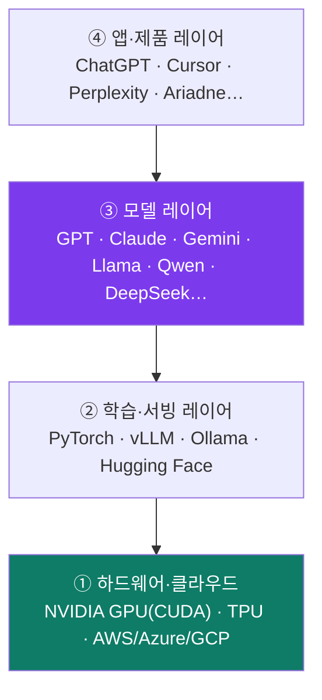
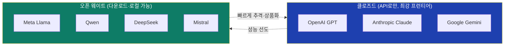
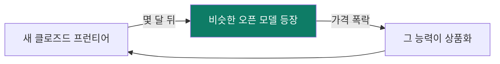
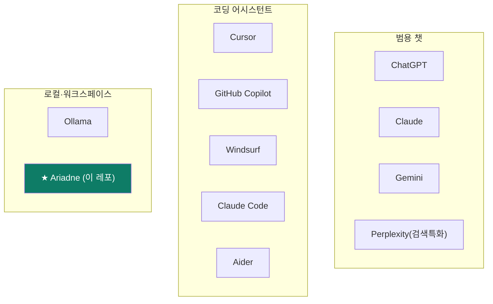
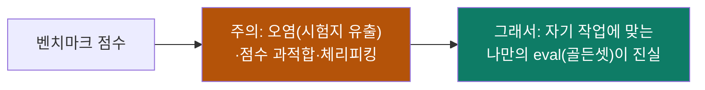
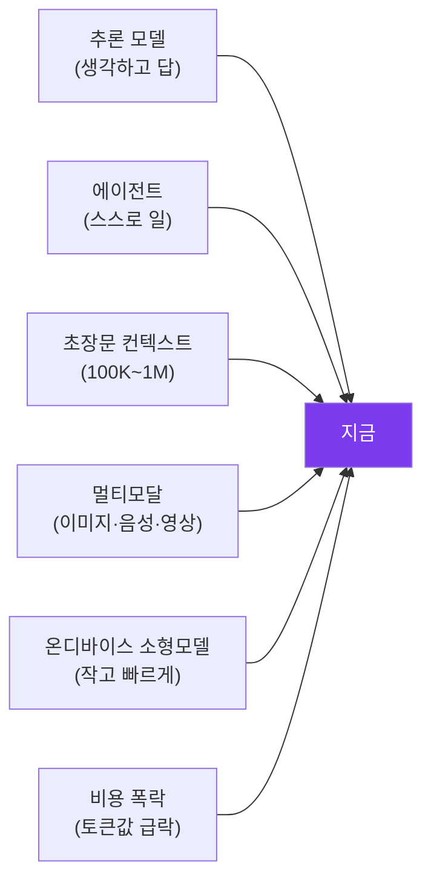
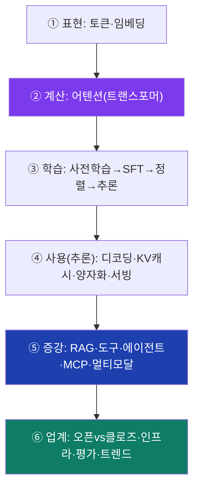

# ⑥ 업계·생태계 — 누가 만들고, 어떻게 경쟁하고, 어디로 가나

> 목표: LLM 업계의 **지도**. 누가 모델을 만들고(제작사), 어떤 층으로 쌓이고
> (스택), 오픈 vs 클로즈드가 어떻게 갈리고, 어떻게 평가하고, 어디로 가는지.
>
> ⚠️ **시점 주의:** 이 판은 *분기마다* 바뀝니다(2026년 6월 기준). 구체적 모델
> 이름·순위보다 **구조와 역학**을 잡으세요. 그건 잘 안 변합니다.

---

## 6.1 스택 — LLM은 여러 층의 산업이다

- **① 하드웨어:** **NVIDIA가 사실상 지배**(GPU + CUDA 소프트웨어 생태계가 해자).
  구글 TPU, AMD가 추격. 모든 AI는 결국 이 칩 위에서 돕니다 → "GPU가 곧 권력".
- **② 학습·서빙:** **PyTorch**(학습 프레임워크 표준), **Hugging Face**(모델·
  데이터 허브 = "AI의 GitHub"), **vLLM/Ollama**(서빙).
- **③ 모델:** 아래 §6.2.
- **④ 앱:** 모델을 제품으로. 챗봇·코딩·검색·비서. 가치가 점점 이 층으로 이동.

> **투자·권력의 관점:** 칩(NVIDIA)과 앱(제품)이 돈을 벌고, 가운데 모델 층은
> 빠르게 **상품화(commoditize)** 되는 중 — 오픈 모델 때문에(§6.3).

---

## 6.2 모델 제작사 — 주요 플레이어

| 제작사 | 모델 | 성향 | 한 줄 |
|---|---|---|---|
| **OpenAI** | GPT, o-시리즈(추론) | 클로즈드, 프런티어 | 대중화의 시작(ChatGPT), 추론모델 선도 |
| **Anthropic** | Claude | 클로즈드, 안전·정직 강조 | 코딩·에이전트·긴 작업에 강함, 기업 신뢰 |
| **Google** | Gemini | 클로즈드, 멀티모달·초장문 | 검색·안드로이드·워크스페이스 통합 |
| **Meta** | **Llama** | **오픈 웨이트** | 오픈 생태계의 방아쇠(누구나 다운로드) |
| **Mistral** (프랑스) | Mistral/Mixtral | 오픈+상업 | 효율적·유럽 진영 |
| **DeepSeek** (중국) | V-시리즈, R1(추론) | **오픈, 초저비용** | "적은 비용으로 프런티어급" 충격 |
| **Alibaba Qwen** (중국) | **Qwen** | 오픈, 다국어 강함 | **Ariadne 로컬 기본(qwen3:8b)** |
| **xAI** | Grok | 클로즈드 | X(트위터) 통합 |
| **Cohere** | Command | 기업·RAG 특화 | B2B 검색·임베딩 |

> **지역 구도:** 미국(OpenAI·Anthropic·Google·Meta) vs 중국(DeepSeek·Qwen 등
> 오픈 강세) vs 유럽(Mistral). 중국發 오픈 모델이 "성능/비용"에서 판을 흔드는 게
> 최근 큰 흐름.

---

## 6.3 오픈 vs 클로즈드 — 가장 중요한 분기

| | **클로즈드 (API)** | **오픈 웨이트 (다운로드)** |
|---|---|---|
| 접근 | API 호출, 가중치 비공개 | 가중치 공개, 내 서버/PC에서 |
| 예 | GPT, Claude, Gemini | Llama, Qwen, DeepSeek, Mistral |
| 장점 | 최강 성능, 운영 불필요 | **프라이버시·통제·무료 구동·커스터마이즈** |
| 단점 | 비용·종속·데이터 외부 전송 | 직접 운영, 보통 프런티어보다 한 발 뒤 |

- **역학:** 프런티어(클로즈드)가 앞서면, 몇 달 뒤 비슷한 **오픈 모델**이 따라와
  그 능력을 **무료·저가로 상품화**. 이 반복이 "모델 층은 상품화된다"의 정체.
- **그래서 local-first가 의미 있다:** Ariadne처럼 **오픈 모델을 내 기기에서**
  돌리면 키·비용·프라이버시 문제에서 자유. 어려운 것만 클라우드로(하이브리드).

### 로컬에서 돌리는 법 (오픈 모델 생태계)
- **Ollama / LM Studio / llama.cpp:** 오픈 모델을 내 PC에서 쉽게 구동.
- **GGUF:** 로컬 구동용 양자화 모델 파일 포맷(모듈 ④). "Q4_K_M" 같은 표기.
- **Hugging Face:** 모델·데이터셋을 받는 허브.

---

## 6.4 앱 레이어 — 유사 서비스 지도

모델 위에 올라간 **제품들**. Ariadne와 비교해 보세요.

| 분류 | 서비스 | 특징 |
|---|---|---|
| 범용 챗 | ChatGPT · Claude · Gemini | 대화·작문·분석. 각 제작사의 간판 앱 |
| 검색특화 | **Perplexity** | RAG로 출처 단 답(웹검색+LLM) |
| 코딩 | **Cursor · Copilot · Windsurf · Claude Code · Aider** | 코드베이스 이해·편집·에이전트 |
| 로컬·자기호스팅 | **Ollama · Ariadne** | 내 기기에서, 프라이버시·통제 |

> **Ariadne의 자리:** "로컬 우선 + 멀티 프로바이더 + 평가 하네스"를 가진 워크
> 스페이스. 코딩 어시스턴트(Cursor류)의 *검색·하네스 기법*과 챗앱의 *대화 경험*을
> local-first로 합친 포지션. 우리가 한 작업(하이브리드 검색·라우팅·eval)이 전부
> 이 경쟁의 일부입니다.

---

## 6.5 평가 — 누가 더 똑똑한지 어떻게 아나

모델 비교엔 **벤치마크**를 씁니다:

| 벤치마크 | 무엇을 잼 |
|---|---|
| **MMLU** | 광범위 지식·시험문제 |
| **GPQA** | 어려운 대학원급 과학 추론 |
| **SWE-bench** | 실제 GitHub 이슈를 코드로 해결(에이전트) |
| **LMArena** | **사람이 두 답 비교 투표**(인간 선호 랭킹) |
| **MATH/AIME** | 수학 추론 |

- ⚠️ **벤치마크 함정:** 훈련 데이터에 시험문제가 섞이는 **오염(contamination)**,
  점수만 노린 과적합, 유리한 것만 보여주는 체리피킹. 공개 순위표는 참고일 뿐.
- **진짜 평가 = 내 작업에 맞춘 골든셋.** Ariadne가 retrieval/RAG를 자체 eval로
  채점하는 이유(모듈 ⑤, 레포 explainer §10). "느낌이 아니라 받침."

---

## 6.6 트렌드 — 어디로 가나 (2024~2026)

1. **추론(reasoning) 모델** — 생각을 더 시켜 똑똑하게(test-time compute, 모듈 ③).
2. **에이전트** — 단발 답에서 *스스로 여러 단계 수행*으로. SWE-bench류가 무대.
3. **초장문 컨텍스트** — 100K~1M 토큰. 단 lost-in-the-middle은 숙제(모듈 ④).
4. **멀티모달** — 이미지·음성·영상이 기본으로.
5. **온디바이스·소형화** — 작고 빠른 모델이 폰·노트북에서. 라우팅으로 큰 모델과
   분업(모듈 ④·⑤).
6. **비용 폭락** — 같은 성능의 토큰 단가가 매년 급락. 오픈 모델이 가속.
7. **표준화** — MCP(도구), 에이전트 프로토콜 등 생태계 규격이 자리잡는 중.

### 안전·정책 (간단히)
- **정렬·레드팀·가드레일**: 모델이 위험·편향·탈옥(jailbreak)에 안 넘어가게(모듈 ③).
- **규제**: EU AI Act 등 지역별 규제가 형성 중. 데이터·저작권·프라이버시 쟁점.

---

## 코스 마무리 — 한 장으로

- LLM = 트랜스포머(어텐션)로 다음 토큰을 예측하도록 거대하게 학습한 함수.
- 한계(환각·최신·내 자료)는 **증강(RAG·도구·에이전트)** 으로 메운다.
- 업계는 NVIDIA(칩)–모델(오픈⇄클로즈드 상품화)–앱(가치 이동)의 3층, 평가는
  벤치마크보다 **내 골든셋**이 진실, 방향은 추론·에이전트·멀티모달·저비용.

**축하합니다 — 코스 완주!** 이제 `01-rag-harness-explainer.md`로 돌아가면, 그
앱이 이 모든 개념을 *실제로 어떻게* 쓰는지 또렷이 보일 겁니다. 그게 마스터의 신호예요.
