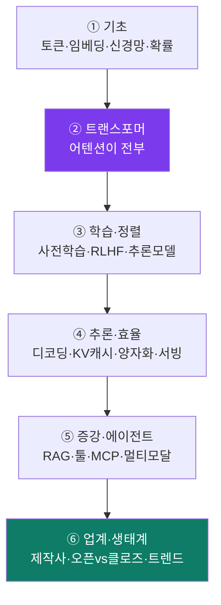
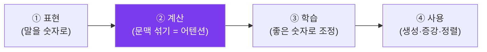

# LLM 마스터 코스 — 큰 그림에서 바닥까지 (한글)

> AI에 대해 **기초 0**이어도 끝까지 따라올 수 있게 썼습니다. 이 레포(Ariadne)와
> 무관하게, **LLM 기술 전반**을 마스터하기 위한 코스입니다. 각 개념은
> **일상 비유 → 그림(mermaid) → 기술 디테일** 순서로 풉니다.
>
> 앞서 만든 `docs/learn/01-rag-harness-explainer.md`(이 레포의 RAG·하네스)와
> `02-rag-harness-deck.pptx`의 **확장판**입니다. 거긴 "우리 앱이 어떻게",
> 여긴 "LLM 자체가 어떻게".
>
> **그림이 코드처럼 보이면?** mermaid 블록입니다. GitHub·VS Code·Obsidian에서
> 그림으로 자동 렌더됩니다. 안 보이면 [mermaid.live](https://mermaid.live)에 붙여넣으세요.

---

## 이 코스의 지도

| 모듈 | 무엇을 배우나 | 한 줄 |
|---|---|---|
| [① 기초](01-foundations.md) | 토큰화, 임베딩, 신경망, 언어모델=확률, in-context learning | "LLM은 무엇을 입력받아 무엇을 내놓나" |
| [② 트랜스포머](02-transformer.md) | **어텐션**, self/multi-head, 위치인코딩, 트랜스포머 블록 | "어떻게 문맥을 이해하나 — 핵심 엔진" |
| [③ 학습·정렬](03-training-alignment.md) | 사전학습, 스케일링 법칙, 파인튜닝, RLHF/DPO, 추론모델 | "어떻게 똑똑해지고, 어떻게 말 잘 듣게 되나" |
| [④ 추론·효율](04-inference-efficiency.md) | 디코딩, KV캐시, 양자화, MoE, flash attention, 서빙 | "어떻게 빠르고 싸게 돌리나" |
| [⑤ 증강·에이전트](05-augmentation-agents.md) | 프롬프트·컨텍스트 엔지니어링, RAG, 툴, 에이전트, MCP, 멀티모달 | "어떻게 한계를 넘어 진짜 일을 시키나" |
| [⑥ 업계·생태계](06-industry-ecosystem.md) | 제작사 비교, 오픈vs클로즈드, 로컬, 인프라, 평가, 트렌드 | "누가·무엇으로·어디로 가고 있나" |

추천 순서: 위에서 아래로. 단, **⑥ 업계**는 언제든 먼저 훑어도 좋습니다(동기 부여).

> **큰 그림 먼저:** `07-llm-mastery-deck.pptx`(20슬라이드, 페이드 전환 + 흐름
> 슬라이드 cascade 애니메이션)로 전체를 한 번 훑은 뒤, 위 모듈들로 깊게 들어가는
> 걸 추천합니다. PPT = 지도, MD = 안내서. (애니메이션은 Keynote/PowerPoint
> 발표 모드에서 재생됩니다.)

---

## 시작 전, LLM을 보는 4개의 렌즈

복잡해 보여도 LLM은 결국 이 네 질문으로 환원됩니다. 모듈을 읽다 길을 잃으면
"지금 어느 렌즈 얘기지?" 를 떠올리세요.

1. **표현 (Representation)** — 단어·문장을 어떻게 숫자로 바꾸나? → 토큰·임베딩 (①)
2. **계산 (Computation)** — 그 숫자들을 어떻게 섞어 "문맥"을 만드나? → 어텐션 (②)
3. **학습 (Learning)** — 그 섞는 방식을 어떻게 "좋게" 조정하나? → 학습·정렬 (③)
4. **사용 (Usage)** — 학습된 모델을 어떻게 빠르고 똑똑하게 쓰나? → 추론·증강 (④⑤)

---

## 핵심 한 문장 정의 (먼저 외워두면 편한 것들)

| 용어 | 한 문장 |
|---|---|
| **LLM** | "다음 토큰"을 확률로 맞히도록 거대한 텍스트로 훈련된 트랜스포머 신경망 |
| **토큰** | 모델이 다루는 글자 덩어리(단어 조각). 입력·출력·비용의 최소 단위 |
| **임베딩** | 토큰/문장의 뜻을 수백~수천 개 숫자(벡터)로 바꾼 좌표 |
| **트랜스포머** | "어텐션"으로 모든 토큰이 서로를 참고하게 만든 신경망 구조 (2017) |
| **어텐션** | 각 토큰이 "다른 어떤 토큰을 얼마나 볼지"를 스스로 정하는 계산 |
| **파라미터** | 모델이 학습으로 조정하는 숫자 손잡이들. "8B" = 80억 개 |
| **사전학습** | 인터넷 텍스트로 다음 토큰 맞히기를 무지막지하게 반복 (지식 습득) |
| **정렬(RLHF)** | 사람 선호로 모델을 "도움 되고 안전하게" 다듬기 |
| **추론(inference)** | 이미 학습된 모델로 실제 답을 생성하는 단계 |
| **컨텍스트 창** | 모델이 한 번에 보는 토큰의 최대 양 (작업기억) |
| **RAG** | 답 전에 관련 자료를 찾아 같이 넣어주는 것 (오픈북) |
| **에이전트** | LLM을 계획→도구사용→재계획 루프로 묶어 일을 시키는 것 |

> 다 이해 못 해도 괜찮습니다. 각 모듈이 하나씩 풀어줍니다. 이제 ①부터 시작하세요.
