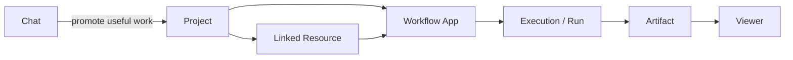

# AIWS Product Model

AIWS is a local-first Workflow App studio for project folders. It is not a generic chatbot shell.

## Chat

Global conversation for quick questions, file inspection, and short-lived work.

- Input: free text, files, pasted tables, optional web approval.
- Output: assistant message, context receipt, optional artifact.
- Use when: the work is exploratory or one-off.

## Project

Bounded local workspace for durable work.

- Contains chats, files, `aiws.yaml`, Workflow Apps, runs, artifacts, and linked resources.
- Project depth stays shallow: `project` or `project/subproject`.
- Project boundaries are explicit. Another project cannot read data unless a link is approved.

## Workflow App

Repeatable project app. This is the user-facing replacement for vague "Action" language.

- Defines typed inputs: file, text, select, number, boolean, linked resource.
- Defines typed outputs: markdown, csv, json, chart, report, text.
- Declares a run policy: local-only, confirmation required, network/cloud/file-write rules.
- Declares viewer slots so outputs render as a dashboard, not only a chat answer.

Internal backend routes may still contain `project-actions` for compatibility. User-facing UI should say Workflow App.

## Execution / Run

Traceable event created when a Workflow App runs.

- Records status, actor, input summary, resolved imports, approval, logs, output files, and errors.
- Stored as a run record so users can inspect what happened later.

## Artifact

Reusable output file from a run.

- Examples: `summary.md`, `csv-profile.json`, `rebalance-suggestions.csv`, chart specs, logs.
- Artifacts can become linked resources for another project.

## Viewer

Frontend renderer for artifacts.

- Selected by `viewer_id`.
- Examples: table viewer, chart viewer, markdown/report viewer, JSON viewer.
- Viewers are allowlisted or trusted local viewers. Project data should not inject arbitrary browser code by default.

## Linked Resource

Explicit project-to-project resource grant.

- Source project exports a typed resource.
- Target project requests/imports it under a local alias.
- Approved links can be used as Workflow App inputs.
- Revoked or pending links are hidden from execution.

## Navigation Model

- **Chat**: global one-off work.
- **Projects**: durable folders and workspaces.
- **Workflow Apps**: catalog of one-off Chat Tools and repeatable project apps.
- **Settings**: account, language, model/API status, local/server preferences.
