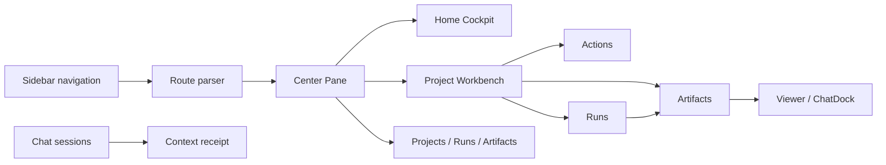

# Product / UI Refactor Report

## Scope

This pass moves AIWS further away from a chat-first prototype and toward a traceable local AI workflow workbench.

The refactor intentionally keeps backend routes compatible. The frontend now exposes more of the real work objects directly:

- Projects
- Sessions
- Runs
- Artifacts
- Workflow Apps

## Main Changes

- Added first-class routes for `/projects`, `/runs`, and `/artifacts`.
- Added reusable work-object cards for projects, sessions, runs, artifacts, and cockpit stats.
- Reworked Home into a cockpit showing recent projects, sessions, runs, and artifacts instead of only launch cards.
- Expanded sidebar navigation around work objects: Home, new chat, new project, Projects, Workflow Apps, Runs, Artifacts, Settings.
- Added Runs as a project tab instead of folding execution history into Artifacts.
- Added Actions as a project tab for executable aiws.yaml capabilities.
- Updated top status bar to show current scope as a separate status chip.
- Kept Power-mode developer internals behind project developer details.

## Current Architecture



## Remaining Work

- LegacyApp still owns part of data refresh and modal orchestration.
- Runs and Artifacts pages currently use available workspace/home payloads; project-wide pagination/search can be added later.
- New Project modal is improved but still backed by existing create/import APIs.
- The full component library is present but not yet applied to every legacy surface.
- Deep viewer/settings/auth screens still need the same work-object design language.

## Verification

Run:

```bash
cd web
npm run typecheck
npm run lint
npm run test -- --run
npm run build
```
