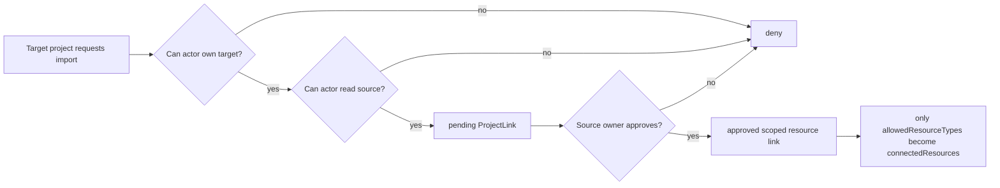

# Security and QA Gate Report

## Scope

This pass expands the frontend gate beyond `vite build` and fixes the highest-risk product boundaries:

- deny-by-default project connection authorization
- viewer registry allowlist only
- no arbitrary workspace plugin code execution path
- frontend contract guards for workflow apps and project connections
- unit/component/e2e coverage for the new workbench surfaces

## Gates

Frontend CI now runs:

1. `npm ci`
2. `npm run lint`
3. `npm run typecheck`
4. `npm run test`
5. `npm run build`
6. `npm run test:e2e`

Backend CI continues to run ruff, format check, mypy subset, bandit, and pytest.

## Authorization

Project connections are relationship-based and deny by default.

The mutation path now goes through `authorize_project_connection_request()` before request, approve, or revoke can modify link state.

## Viewer Boundary

Workflow apps may declare `viewer_id`, but the frontend resolves it through `VIEWER_REGISTRY` only. Unknown values fall back to `textViewer`.

There is no runtime path for:

- `eval`
- `new Function`
- project-provided TS/JS viewer execution
- remote viewer code fetching

ESLint and tests lock this down.

## Frontend Contract Guards

Untrusted backend payloads for workflow apps and project connections pass through parser/type guards:

- `isWorkflowAppDefinition`
- `parseWorkflowApps`
- `parseProjectConnections`

Unknown viewer ids are rejected by the workflow app guard.

## Tests Added

Unit:

- workflow app definition validation
- viewer registry resolution
- project link permission matrix

Component:

- ChatComposer + ToolPicker
- WorkflowAppShell + ViewerPane
- ConnectionsTab
- ContextReceiptCard

E2E smoke:

- home load
- Apps & Tools catalog navigation
- project dashboard open
- investment_rebalancer launch surface
- Chat Dock prompt send
- unauthorized linked resource access blocked

## Remaining Risk

- The frontend still has legacy JS components under `allowJs`; lint/typecheck now gates them, but full TS conversion is still incremental.
- Vite reports a large chunk warning. The next quality pass should code-split legacy shell, model picker, workflow viewers, and markdown rendering.
- E2E smoke uses mocked API payloads. Backend API behavior is covered by pytest; a later integration suite can launch the Python server with a temporary workspace.
